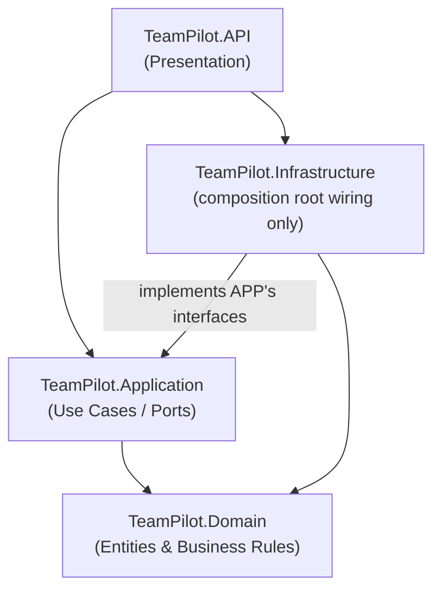
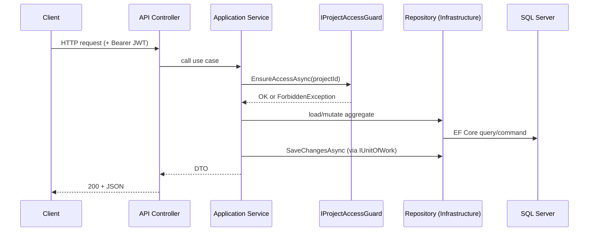

# TeamPilot

TeamPilot is an AI-powered ticketing and development-orchestration system. It combines a
Kanban-style ticket board, AI agent orchestration (research/design/coding agents managed by a
per-project orchestrator), Git integration, and a human approval gate, so that a project's
day-to-day development work can be tracked, delegated to AI agents, reviewed, and merged
through one system.

This repository currently contains the **backend API** (`TeamPilot.API`) built with
.NET 10 / ASP.NET Core. A companion Angular frontend is planned (see
[constitution/Angular-20-UI-Development-Guidelines.MD](constitution/Angular-20-UI-Development-Guidelines.MD))
but has not been started yet.

## Contents

- [Purpose, scope, and goals](#purpose-scope-and-goals)
- [Getting started](#getting-started)
- [Architecture](#architecture)
- [Coding standards](#coding-standards)
- [Workflow](#workflow)
- [Authentication](#authentication)
- [Module documentation](#module-documentation)

## Purpose, scope, and goals

**Purpose.** Give a team a single system to create tickets, have AI agents work on them
against a real Git repository, and route the result through a human approval gate before it
merges — with role-based access so people only see and act on the projects they're assigned to.

**Scope (current).**
- Multi-project support: each `Project` owns its own Git repository, orchestrator + sub-agents,
  ticket board, and CI/CD pipeline run history.
- Ticket lifecycle: `ToDo → InProgress → ForReview → Done`, with agent assignment, LLM-driven
  agent work, Git commits, merge-conflict detection/resolution, and an approval gate.
- Identity: sign-in via Google or Microsoft only (no local passwords), JWT-based sessions with
  rotating refresh tokens, and three fixed roles (Admin, Analyst, Developer).
- CI/CD: status tracking only (`PipelineRun` entities with a Queued → Running →
  Succeeded/Failed lifecycle) — no real build/test/deploy execution yet.

**Out of scope (for now).** The Angular frontend, a real CI/CD runner, multi-provider LLM
support beyond Claude, and asymmetric JWT signing (see each module's "Future considerations"
for the reasoning behind these deferrals).

**Goals.**
1. Keep business rules in the Domain layer, independent of any framework.
2. Enforce access control (role- and project-based) in the Application layer, not just at the
   API boundary.
3. Prefer real integrations (LibGit2Sharp, Anthropic's Claude API, OpenID Connect) over stubs,
   scoped tightly to what's actually asked for.

## Getting started

### Prerequisites

| Tool | Notes |
|---|---|
| [.NET 10 SDK](https://dotnet.microsoft.com/download) | `dotnet --version` should report `10.0.x` |
| SQL Server LocalDB | Ships with Visual Studio, or install the standalone [SQL Server Express LocalDB](https://learn.microsoft.com/sql/database-engine/configure-windows/sql-server-express-localdb) |
| Git | Required at runtime too — each `Project.RepositoryPath` must point at a real, already-`git init`'d local repository with at least one commit |

### Clone and restore

```bash
git clone https://github.com/johncarlo-ph/TeamPilot.git
cd TeamPilot
dotnet restore TeamPilot.slnx
```

### Configure secrets

No secret values are committed. Set them via `dotnet user-secrets` against the API project:

```bash
cd src/TeamPilot.API
dotnet user-secrets init

# Symmetric HS256 signing key for OUR issued JWTs (not the OAuth providers' keys)
dotnet user-secrets set "Jwt:SigningKey" "<a long random string, at least 32 characters>"

# Bootstraps the very first Admin account - every other new user starts with zero roles
dotnet user-secrets set "Auth:SeedAdminEmails:0" "you@example.com"

# Your OAuth client IDs registered with each provider (the id_token's `aud` must match)
dotnet user-secrets set "Auth:Providers:Google:Audience" "<google-oauth-client-id>"
dotnet user-secrets set "Auth:Providers:Microsoft:Audience" "<microsoft-oauth-client-id>"

# Optional - only needed to exercise agent LLM calls for real
dotnet user-secrets set "Llm:ApiKey" "<anthropic-api-key>"
```

See [appsettings.json](src/TeamPilot.API/appsettings.json) for the full set of configuration
keys (connection string, JWT lifetimes, provider discovery URLs, etc.) and
[docs/api.md](docs/api.md#configuration) for what each one does.

### Environment variables

The app also honors the standard ASP.NET Core environment variable,
`ASPNETCORE_ENVIRONMENT` (defaults to `Development` via `launchSettings.json` when run with
`dotnet run`). No other environment variables are required — everything else is configuration
or user-secrets.

### Database

```bash
cd C:\path\to\TeamPilot   # solution root
dotnet tool restore        # installs the pinned dotnet-ef version from .config/dotnet-tools.json
dotnet ef database update --project src/TeamPilot.Infrastructure --startup-project src/TeamPilot.API
```

This creates the `TeamPilotDb` database on `(localdb)\mssqllocaldb` and applies all migrations.

### Build, test, run

```bash
dotnet build TeamPilot.slnx
dotnet test TeamPilot.slnx
dotnet run --project src/TeamPilot.API
```

Once running, open `https://localhost:<port>/swagger` (see the console output for the exact
port, or check `src/TeamPilot.API/Properties/launchSettings.json`) for the interactive API
docs. Every endpoint except `POST /api/auth/login/{provider}`, `POST /api/auth/refresh`, and
`POST /api/auth/logout` requires a bearer token — use Swagger's "Authorize" button once you
have one.

## Architecture

TeamPilot follows Clean Architecture: dependencies point inward, and the Domain layer has no
framework dependencies at all.



| Project | Layer | Depends on | Purpose |
|---|---|---|---|
| [`TeamPilot.Domain`](src/TeamPilot.Domain) | Domain | *(nothing)* | Entities, enums, domain exceptions — pure C#, zero NuGet packages. |
| [`TeamPilot.Application`](src/TeamPilot.Application) | Application | Domain | Use-case services, repository/service **interfaces** (the ports), validators, DTOs. |
| [`TeamPilot.Infrastructure`](src/TeamPilot.Infrastructure) | Infrastructure | Application, Domain | EF Core persistence, LibGit2Sharp, Claude HTTP client, JWT/OIDC — the **adapters**. |
| [`TeamPilot.API`](src/TeamPilot.API) | Presentation | Application, Infrastructure (composition root only) | ASP.NET Core controllers, auth pipeline, Swagger. |

`TeamPilot.API` references `TeamPilot.Infrastructure` only to wire it up in `Program.cs`
(`AddInfrastructure(...)`) — controllers themselves depend on `TeamPilot.Application`
interfaces, never on Infrastructure types directly.

See the per-module docs for what's inside each project:

- [docs/domain.md](docs/domain.md)
- [docs/application.md](docs/application.md)
- [docs/infrastructure.md](docs/infrastructure.md)
- [docs/api.md](docs/api.md)
- [docs/cross-cutting-concerns.md](docs/cross-cutting-concerns.md)

### Request flow (typical write operation)



## Coding standards

Full guidelines live in [constitution/](constitution) and are binding project conventions
(see [CLAUDE.md](CLAUDE.md)). Summary for the backend:

- **Naming:** `PascalCase` for types/members, `camelCase` for locals/parameters, descriptive
  names over abbreviations (`ITicketRepository`, not `ITixRepo`).
- **Clean Architecture dependency rule:** inner layers (Domain, then Application) never
  reference outer layers. Enforced structurally by the project reference graph above.
- **SOLID**, applied concretely as: per-aggregate repository interfaces instead of one generic
  `IRepository<T>` (Interface Segregation); services depend on interfaces, not concrete
  Infrastructure classes (Dependency Inversion).
- **Rich domain models:** entities have private setters and behavior methods
  (`ticket.Approve()`, not `ticket.Status = Done`); invariants are guarded in the entity itself.
- **EF Core:** `DbContext` is scoped (never singleton); `AsNoTracking()` for read-only queries;
  `Include()`/projection chosen deliberately per call site to avoid N+1s; unique/FK constraints
  defined alongside EF validation, not instead of it.
- **Validation:** FluentValidation for all request DTOs, not `DataAnnotations`.
- **Testing:** xUnit + Moq, Arrange-Act-Assert, test names as
  `MethodName_StateUnderTest_ExpectedBehavior`.
- **Comments:** only where the *why* isn't obvious from the code (a non-obvious constraint, a
  workaround, a subtle invariant) — not restating what a well-named method already says.
- **StyleCop / formatting:** standard .NET conventions (`dotnet format` compatible); no custom
  `.editorconfig` overrides beyond the SDK defaults yet.

The Angular guidelines in [constitution/Angular-20-UI-Development-Guidelines.MD](constitution/Angular-20-UI-Development-Guidelines.MD)
(standalone components, signals for local state, typed reactive forms, strict mode) apply once
frontend work starts — there is no frontend code to check against them yet.

## Workflow

### Branching

The repository currently has a single active branch (`master`, tracking
`origin/master`; note `origin/HEAD` points at `origin/main` — these have diverged and should be
reconciled before adopting a stricter workflow). No formal branching strategy is enforced yet.
**Recommended** going forward: short-lived `feature/*` branches off `master`, merged via pull
request.

### CI/CD

**Not yet configured** — there is no `.github/workflows` (or equivalent) pipeline in this
repository. Recommended first step: a GitHub Actions workflow that runs on every PR:

```yaml
# .github/workflows/ci.yml (proposed, not yet present)
- dotnet restore TeamPilot.slnx
- dotnet build TeamPilot.slnx --no-restore
- dotnet test TeamPilot.slnx --no-build
```

`PipelineRun` (see [docs/application.md](docs/application.md#pipelines)) already models a
CI/CD status lifecycle at the *product* level (a project's own pipeline runs), which is a
separate concern from the *repository's own* CI — don't conflate the two.

### Testing approach

- **Unit tests only, today:** `tests/TeamPilot.Domain.Tests` (entity invariants/behavior) and
  `tests/TeamPilot.Application.Tests` (use-case services with mocked repositories/collaborators
  via Moq). Run with `dotnet test TeamPilot.slnx`.
- **Integration/E2E tests do not exist yet.** See
  [docs/cross-cutting-concerns.md](docs/cross-cutting-concerns.md#testing-strategy) for the
  recommended approach (a `WebApplicationFactory`-based API test project, and/or a real
  LocalDB/Testcontainers-backed repository test suite) before relying on this system in
  production.

## Authentication

**Method:** OpenID Connect (Google and Microsoft only — no local username/password) for
sign-in, our own JWT access + rotating refresh tokens for session management, all delivered
via a SPA-driven token-relay flow (the client does the OAuth dance with the provider's own
SDK and hands us a verified `id_token`; we never redirect through our own backend for login).

**Why this design:**
- Token relay (vs. a backend-driven redirect flow) keeps the API stateless and simple to test,
  and matches a SPA architecture where the frontend already has first-class Google/Microsoft
  sign-in SDKs.
- JWTs (not server-side sessions) let the API stay horizontally scalable with no shared session
  store.
- Refresh-token rotation with reuse detection (presenting an already-rotated token revokes the
  user's *entire* session family) is the standard OAuth2 mitigation for a stolen refresh token.
- Three fixed roles (Admin / Analyst / Developer) plus per-user project assignment give
  coarse-grained RBAC and fine-grained data scoping without a full permissions engine — the
  simplest thing that satisfies the actual product requirements.

**Integration points:** see [docs/api.md](docs/api.md#authentication) for the exact pipeline
wiring and [docs/application.md](docs/application.md#auth) for where roles/project-access are
actually enforced (in Application services, not just `[Authorize]` attributes).

## Module documentation

| Module | What it covers |
|---|---|
| [docs/domain.md](docs/domain.md) | Entities, invariants, the domain exception hierarchy |
| [docs/application.md](docs/application.md) | Use-case services, RBAC/project-access enforcement, validation |
| [docs/infrastructure.md](docs/infrastructure.md) | EF Core, Git, LLM, and JWT/OIDC implementations |
| [docs/api.md](docs/api.md) | Controllers, auth pipeline, error responses |
| [docs/cross-cutting-concerns.md](docs/cross-cutting-concerns.md) | Logging, testing strategy, security practices, deployment |
