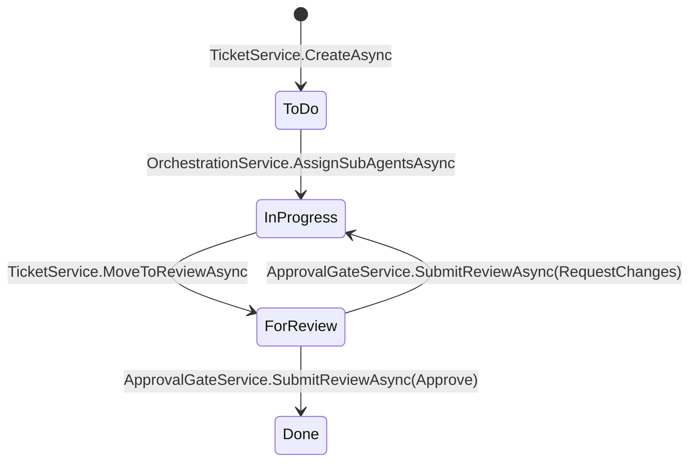

# Application Module (`TeamPilot.Application`)

[← Back to README](../README.md)

## Purpose

`TeamPilot.Application` is where use cases live: it orchestrates Domain entities to fulfill a
request, defines the **interfaces** (ports) that Infrastructure implements, and is the layer
that enforces both role-based authorization and per-project data scoping. It depends only on
`TeamPilot.Domain` plus a small set of framework-agnostic packages (FluentValidation, the
`Microsoft.Extensions.*` abstraction packages for logging/options/DI — never a concrete
implementation like EF Core or ASP.NET Core).

Its role in the architecture is the Dependency Inversion boundary: Presentation and
Infrastructure both depend on it, but it depends on neither.

## Feature folders

| Folder | Responsibility |
|---|---|
| [`Auth/`](../src/TeamPilot.Application/Auth) | Login/refresh/logout use cases, audit logging, JWT/refresh-token/email-validation abstractions |
| [`Users/`](../src/TeamPilot.Application/Users) | Admin user management: roles, enable/disable, project assignment |
| [`Projects/`](../src/TeamPilot.Application/Projects) | Project CRUD, project-scoped listing for non-admins |
| [`Tickets/`](../src/TeamPilot.Application/Tickets) | Ticket board CRUD, branch linking |
| [`Agents/`](../src/TeamPilot.Application/Agents) | Agent CRUD, one-orchestrator-per-project rule |
| [`Instructions/`](../src/TeamPilot.Application/Instructions) | Versioned agent instructions |
| [`Orchestration/`](../src/TeamPilot.Application/Orchestration) | Assigning agents to tickets, executing agent work (LLM call + optional commit) |
| [`Approval/`](../src/TeamPilot.Application/Approval) | The approval gate: review submission, merge, pipeline trigger |
| [`Conflicts/`](../src/TeamPilot.Application/Conflicts) | Merge-conflict detection and resolution |
| [`Pipelines/`](../src/TeamPilot.Application/Pipelines) | CI/CD status-tracking use cases |
| [`AuditLog/`](../src/TeamPilot.Application/AuditLog) | Read-side of the audit log |
| [`Git/`](../src/TeamPilot.Application/Git), [`Llm/`](../src/TeamPilot.Application/Llm) | `IGitService`/`ILlmConnector` port declarations (implemented in Infrastructure) |
| [`Reviews/`](../src/TeamPilot.Application/Reviews), [`Commits/`](../src/TeamPilot.Application/Commits) | Read-only repository interfaces for child records |
| [`Common/`](../src/TeamPilot.Application/Common) | `IUnitOfWork`, `ICurrentUserContext`, `IProjectAccessGuard`, shared exceptions, validator extensions |
| [`DependencyInjection/`](../src/TeamPilot.Application/DependencyInjection) | `AddApplication()` DI registration |

## Architectural decisions

**Per-aggregate repository interfaces, not a generic `IRepository<T>`.** `ITicketRepository`,
`IAgentRepository`, `IUserRepository`, etc. each expose exactly the query shapes their use
cases need (e.g. `ITicketRepository.GetByIdAsync` eager-loads the full ticket graph;
`ListAsync` is a lean, `AsNoTracking()`-friendly projection). A single generic repository would
either force every caller to accept a fat interface or push `Include()`/`AsNoTracking()`
decisions into a shared, one-size-fits-all method — this violates Interface Segregation for
marginal code reduction, so it was rejected.

**`IProjectAccessGuard` centralizes project-scoping instead of repeating it.** Every
ticket-board-adjacent service (`TicketService`, `AgentService`, `InstructionService`,
`OrchestrationService`, `ApprovalGateService`, `ConflictResolutionService`, `PipelineService`,
`ProjectService`) calls `projectAccessGuard.EnsureAccessAsync(projectId)` before acting.
Admins bypass it; everyone else must have that project in their `UserProjectAssignment` set.
This is enforced **in Application, not just at the controller** — a design decision made
explicitly so that a future second HTTP surface (or a background job) can't accidentally skip
the check by calling a service directly.

**FluentValidation over `DataAnnotations`.** Validators are independently testable classes
(`CreateTicketRequestValidator`, etc.), support conditional/cross-field rules the domain
actually needs, and are resolved via DI (`AddValidatorsFromAssemblyContaining<T>()`) rather
than being coupled to ASP.NET Core's model-binding pipeline — so the same validation runs
regardless of what calls the service.

**`ICurrentUserContext` is declared here, implemented in Presentation.** The interface only
needs `UserId`, `Name`, `Email`, `Roles`, and `IsInRole(role)` — it says nothing about
`HttpContext` or claims. This lets every service that needs "who is calling right now" depend
on an Application abstraction instead of reaching into ASP.NET Core.

**`IUnitOfWork` hides EF Core's transaction API.** `ExecuteInTransactionAsync` wraps
`IDbContextTransaction` inside the Infrastructure implementation so Application code can
express "these steps are atomic" without importing an EF Core type.

**DTOs double as API request/response contracts.** There is no separate "API model" layer —
`TicketDto`, `CreateTicketRequest`, etc. are used directly by controllers. This avoids a
duplicate mapping layer; the trade-off is that Application DTOs are, by construction, also part
of the public HTTP contract, so changing one is a breaking API change.

## Code style notes

- Services use C# primary constructors for DI (`public sealed class TicketService(ITicketRepository ticketRepository, ...)`).
- Every public method takes a trailing `CancellationToken cancellationToken = default` and
  threads it through to every repository/service call.
- Validation happens first in every method that has a validator:
  `await validator.EnsureValidAsync(request, cancellationToken);` (a custom extension in
  `Common/Extensions/ValidatorExtensions.cs` that throws the Application's own
  `ValidationException`, not FluentValidation's, keeping FluentValidation's exception type out
  of the rest of the codebase).
- Entity-to-DTO mapping is a private `static ToDto(...)` method at the bottom of each service —
  no AutoMapper, so the mapping is explicit and grep-able.
- Cross-feature references are normal within this project (e.g. `OrchestrationService`
  references `Tickets`, `Agents`, `Commits` DTOs) — feature folders organize by use case, they
  are not separate assemblies.

## Workflow integration

A typical write request flows: **Controller → Application service → domain entity method(s) →
repository (Infrastructure) → `IUnitOfWork.SaveChangesAsync()`**. Read requests skip the
domain-mutation step and go straight to a repository's lean, `AsNoTracking()` query, mapped to
a DTO.

The **ticket lifecycle** is the central workflow this module orchestrates:



Approving a ticket also triggers a `PipelineRun` via `IPipelineService.TriggerAsync` — the
approval gate and CI/CD status tracking are connected at this one point.

## Auth

Authentication *use cases* (not token mechanics — those are Infrastructure) live in
[`Auth/AuthService.cs`](../src/TeamPilot.Application/Auth/AuthService.cs):

- `LoginAsync`: validates the external `id_token` (via `IExternalIdentityValidator`), finds or
  creates the `User` by email, auto-grants Admin if the email matches `Auth:SeedAdminEmails`,
  blocks disabled accounts, and issues a new access + refresh token pair.
- `RefreshAsync`: rotates the refresh token. If the presented token was already rotated away
  (reuse), it revokes **every** active token for that user and audit-logs
  `TokenReuseDetected` — the standard mitigation for a stolen refresh token.
- `LogoutAsync`: revokes the presented refresh token.

**Role and project enforcement** happens at the call sites listed under "Architectural
decisions" above, plus one extra rule in `ApprovalGateService.SubmitReviewAsync`: submitting a
`ReviewDecision.Approve` requires the caller to be `Admin` or `Developer` — an `Analyst` can
submit `RequestChanges`/`ResolveConflict` but not approve, matching the product's role
definitions. This check inspects the *request body* (the decision value), so it can't be
expressed as a static `[Authorize(Roles=...)]` attribute — it lives in the service.

## Example

```csharp
public async Task<TicketDto> SubmitReviewAsync(Guid ticketId, SubmitReviewRequest request, CancellationToken ct = default)
{
    await validator.EnsureValidAsync(request, ct);

    var ticket = await ticketRepository.GetByIdAsync(ticketId, ct)
        ?? throw new NotFoundException(nameof(Ticket), ticketId);

    await projectAccessGuard.EnsureAccessAsync(ticket.ProjectId, ct);

    if (request.Decision == ReviewDecision.Approve
        && !currentUser.IsInRole(UserRole.Admin)
        && !currentUser.IsInRole(UserRole.Developer))
    {
        throw new ForbiddenException("Only Developers or Admins may approve tickets.");
    }
    // ... record the review, approve + merge inside a transaction, trigger a pipeline run
}
```

## Error handling

| Exception | Meaning | Thrown by |
|---|---|---|
| `Common.Exceptions.ValidationException` | FluentValidation failed | `EnsureValidAsync` |
| `Common.Exceptions.NotFoundException` | Referenced entity doesn't exist | Any `GetByIdAsync` call site |
| `Common.Exceptions.ForbiddenException` | Wrong role or no project access | `IProjectAccessGuard`, role checks |
| `Common.Exceptions.AuthenticationFailedException` | Bad/expired/reused token, disabled account | `AuthService` |
| `Domain.Exceptions.DomainException` (any subtype) | Domain invariant violated | Entity behavior methods, allowed to propagate unchanged |

None of these are caught within Application — they propagate to the API's
`GlobalExceptionHandler`, which is the single place HTTP status codes are decided (see
[docs/api.md](api.md#error-handling)).

## Future considerations

- **Mediator pattern:** as the number of use-case services grows, a mediator (e.g. MediatR)
  could reduce controller-to-service boilerplate — not adopted yet because the current number
  of use cases doesn't justify the extra indirection.
- **Real pipeline execution:** `PipelineService` only tracks status today; wiring it to an
  actual `ICiCdPipelineRunner` abstraction (mentioned as an option during Phase 2 planning but
  deferred) is the natural next step once real CI needs exist.
- **Caching:** `ProjectService.ListAsync`'s per-request `GetAssignedProjectIdsAsync` lookup for
  non-admins is a candidate for short-lived caching if project-assignment churn stays low
  relative to read volume.
- **Review attribution:** `SubmitReviewRequest.ReviewerName` is still a client-supplied free-text
  field rather than derived from `ICurrentUserContext` — the Approve role gate itself doesn't
  depend on it, but tightening this would improve audit-trail integrity (a user could type any
  name into the field today).
