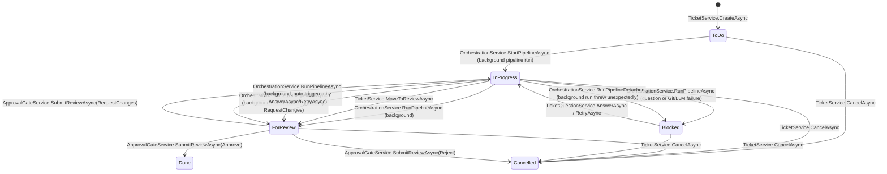

# Application Module (`TeamPilot.Application`)

[← Back to README](../README.md)

## Purpose

`TeamPilot.Application` is where use cases live: it orchestrates Domain entities to fulfill a
request, defines the **interfaces** (ports) that Infrastructure implements, and is the layer
that enforces both role-based authorization and per-project data scoping. It depends only on
`TeamPilot.Domain` plus a small set of framework-agnostic packages (FluentValidation, the
`Microsoft.Extensions.*` abstraction packages for logging/options/DI — never a concrete
implementation like EF Core or ASP.NET Core).

Its role in the architecture is the Dependency Inversion boundary: Presentation and
Infrastructure both depend on it, but it depends on neither.

## Feature folders

| Folder | Responsibility |
|---|---|
| [`Auth/`](../src/TeamPilot.Application/Auth) | Login/refresh/logout use cases, audit logging, JWT/refresh-token/email-validation abstractions |
| [`Users/`](../src/TeamPilot.Application/Users) | Admin user management: roles, enable/disable, project assignment |
| [`Projects/`](../src/TeamPilot.Application/Projects) | Project CRUD (identity + Git connection only), project-scoped listing for non-admins |
| [`Sprints/`](../src/TeamPilot.Application/Sprints) | Sprint CRUD within a project - branch and sprint details (start/end date, goal); owns the ticket-status-count rollup for the sprint list |
| [`Tickets/`](../src/TeamPilot.Application/Tickets) | Ticket board CRUD, branch linking - a ticket's parent is a `Sprint`, or `null` for a project's backlog until assigned |
| [`Tickets/Mentions/`](../src/TeamPilot.Application/Tickets/Mentions) | `MentionParser` - extracts `@[Label](ticket:<id>)`/`@[Label](project:<id>)`/`@[Label](file:<projectId>:<path>)` tokens out of a ticket's `Description`, see "Cross-referencing other tickets/projects/files via '@'-mentions" below |
| [`Mentions/`](../src/TeamPilot.Application/Mentions) | `IMentionSearchService` - the Project/Ticket (cross-project) and File (per-project) search backing the "@" mention-autocomplete dropdown |
| [`TicketProjectInstructions/`](../src/TeamPilot.Application/TicketProjectInstructions) | `ITicketProjectInstructionRepository` - append/list for the non-blocking "referenced project needs a change" notes a Research/Design stage can raise |
| [`TicketPipelineNotes/`](../src/TeamPilot.Application/TicketPipelineNotes) | `ITicketPipelineNoteRepository` - append/list for the non-blocking human-facing notes any pipeline stage can leave via the `NOTES:` marker |
| [`Agents/`](../src/TeamPilot.Application/Agents) | Provisioning/self-healing the 4 default pipeline agents plus the standing `LiveAgent` per project; read/configure/activate-deactivate. Custom-agent creation and pipeline placement live in `Workflow/`, not here |
| [`Instructions/`](../src/TeamPilot.Application/Instructions) | Versioned agent instructions |
| [`InstructionTemplates/`](../src/TeamPilot.Application/InstructionTemplates) | Admin-managed catalog of reusable instructions an admin can apply to a real agent |
| [`Workflow/`](../src/TeamPilot.Application/Workflow) | Admin-configurable per-project agent workflow: add a blank custom agent, place/remove/reorder stages, and set/clear a stage's loop-back - see "The agent workflow is admin-configurable per project" below |
| [`Orchestration/`](../src/TeamPilot.Application/Orchestration) | Running a ticket through its project's configured agent workflow (`Workflow/`), including jumping back to an earlier stage when one with a loop-back reports failure, and blocking the ticket when a stage asks a clarifying question, raises a proceed-or-cancel decision, or a known Git/LLM failure occurs |
| [`TicketQuestions/`](../src/TeamPilot.Application/TicketQuestions) | Answering a blocked ticket's clarifying question or decision, or retrying after a blocking failure - either way, unblocks the ticket and re-invokes `Orchestration/` |
| [`LiveAgentChat/`](../src/TeamPilot.Application/LiveAgentChat) | A project's chat sessions with its `LiveAgent` - any project member can start their own and every member sees the full list; each session persists its own conversation and runs a bounded Claude tool-use loop (read-only, sandboxed repo file access; ticket listing and per-ticket detail; ticket drafting) — see [LiveAgentChat / the Live Agent chat](#liveagentchat--the-live-agent-chat) below |
| [`Approval/`](../src/TeamPilot.Application/Approval) | The approval gate: review submission, merge |
| [`Conflicts/`](../src/TeamPilot.Application/Conflicts) | Merge-conflict detection and resolution |
| [`AuditLog/`](../src/TeamPilot.Application/AuditLog) | Read-side of the audit log |
| [`Dashboard/`](../src/TeamPilot.Application/Dashboard) | Read-only cross-project rollup for the projects landing page: active sprint count, global ticket-status counts, and a "needs attention" list (Blocked/ForReview tickets, at-risk sprints) - see [Architectural decisions](#architectural-decisions) below for how it's scoped instead of using `IProjectAccessGuard` |
| [`Git/`](../src/TeamPilot.Application/Git), [`Llm/`](../src/TeamPilot.Application/Llm) | `IGitService`/`ILlmConnector` port declarations (implemented in Infrastructure) |
| [`Common/Interfaces/IGitCredentialProtector.cs`](../src/TeamPilot.Application/Common/Interfaces/IGitCredentialProtector.cs) | Encrypts/decrypts a project's remote access token for storage (implemented in Infrastructure via Data Protection) |
| [`Reviews/`](../src/TeamPilot.Application/Reviews), [`Commits/`](../src/TeamPilot.Application/Commits) | Read-only repository interfaces for child records |
| [`Common/`](../src/TeamPilot.Application/Common) | `IUnitOfWork`, `ICurrentUserContext`, `IProjectAccessGuard`, `IProjectEventBroadcaster`, shared exceptions, validator extensions |
| [`DependencyInjection/`](../src/TeamPilot.Application/DependencyInjection) | `AddApplication()` DI registration |

## Architectural decisions

**Per-aggregate repository interfaces, not a generic `IRepository<T>`.** `ITicketRepository`,
`IAgentRepository`, `IUserRepository`, etc. each expose exactly the query shapes their use
cases need (e.g. `ITicketRepository.GetByIdAsync` eager-loads the full ticket graph;
`ListAsync` is a lean, `AsNoTracking()`-friendly projection). A single generic repository would
either force every caller to accept a fat interface or push `Include()`/`AsNoTracking()`
decisions into a shared, one-size-fits-all method — this violates Interface Segregation for
marginal code reduction, so it was rejected.

**`DashboardService` scopes itself to accessible projects directly instead of using
`IProjectAccessGuard`.** `IProjectAccessGuard.EnsureAccessAsync` checks access to *one* project
id and throws if denied - not a fit for a rollup that spans every project the caller can see at
once. Instead `DashboardService` computes its own accessible-project-id set (mirroring
`ProjectService.ListAsync`'s exact rule: Admins get every non-removed project, everyone else only
their `UserProjectAssignment` set) and passes it into every `IDashboardRepository` query, so a
non-admin's dashboard numbers and "needs attention" lists never include a project they can't open.

**`IDashboardRepository` is the one repository allowed to join across aggregates.** `Project`,
`Sprint`, and `Ticket` are deliberately independent aggregates that reference each other by id
only (see [docs/domain.md](domain.md)) - every other repository stays scoped to its own aggregate
accordingly. The dashboard summary has no aggregate of its own, so `DashboardRepository`
(Infrastructure) is a narrow, explicit exception: it queries `Projects`/`Sprints`/`Tickets`
together in a handful of single-pass, `AsNoTracking()` projections (same style as
`TicketRepository.GetStatusCountsBySprintAsync`) rather than composing several per-aggregate
repository calls and joining in memory.

**`IProjectAccessGuard` centralizes project-scoping instead of repeating it.** Every
ticket-board-adjacent service (`TicketService`, `SprintService`, `AgentService`,
`InstructionService`, `OrchestrationService`, `ApprovalGateService`, `ConflictResolutionService`,
`ProjectService`) calls `projectAccessGuard.EnsureAccessAsync(projectId)` before acting.
Admins bypass it; everyone else must have that project in their `UserProjectAssignment` set.
This is enforced **in Application, not just at the controller** — a design decision made
explicitly so that a future second HTTP surface (or a background job) can't accidentally skip
the check by calling a service directly. It stays keyed on project id even after `Sprint`/`Ticket`
moved underneath `Project` in this app's hierarchy: `Sprint.ProjectId` and `Ticket`'s
*denormalized* `ProjectId` (see [docs/domain.md](domain.md)) mean `SprintService` and
`TicketService` can call `EnsureAccessAsync` exactly as before, without a join through `Sprint` on
every check.

**FluentValidation over `DataAnnotations`.** Validators are independently testable classes
(`CreateTicketRequestValidator`, etc.), support conditional/cross-field rules the domain
actually needs, and are resolved via DI (`AddValidatorsFromAssemblyContaining<T>()`) rather
than being coupled to ASP.NET Core's model-binding pipeline — so the same validation runs
regardless of what calls the service.

**`ICurrentUserContext` is declared here, implemented in Presentation.** The interface only
needs `UserId`, `Name`, `Email`, `Roles`, and `IsInRole(role)` — it says nothing about
`HttpContext` or claims. This lets every service that needs "who is calling right now" depend
on an Application abstraction instead of reaching into ASP.NET Core.

**`IUnitOfWork` hides EF Core's transaction API.** `ExecuteInTransactionAsync` wraps
`IDbContextTransaction` inside the Infrastructure implementation so Application code can
express "these steps are atomic" without importing an EF Core type.

**DTOs double as API request/response contracts.** There is no separate "API model" layer —
`TicketDto`, `CreateTicketRequest`, etc. are used directly by controllers. This avoids a
duplicate mapping layer; the trade-off is that Application DTOs are, by construction, also part
of the public HTTP contract, so changing one is a breaking API change.

**Projects are tied to a remote repository, not a pre-existing local one — and the clone runs
detached, not inline.** `ProjectService.CreateAsync` encrypts the submitted access token via
`IGitCredentialProtector`, persists the project immediately (`Project.Status: Cloning`,
`RepositoryPath` still empty), and returns right away — the actual `IGitService.CloneAsync` call
is dispatched via `IBackgroundTaskRunner`, the same detached-execution pattern
`OrchestrationService.RunPipelineDetached` uses (see "Detached execution" below), instead of being
awaited inline. This replaces the project's older invariant of "clone before persisting, so a bad
URL/token leaves no row behind" — a failed clone now leaves the row visible as
`Project.Status: Failed` with `CloneFailureReason` set, the same way a failed ticket pipeline run
stays visible as `Blocked` rather than disappearing. `Project.RemoteUrl` is immutable after
creation (re-pointing it would orphan the existing sandbox clone) — only `Name`/`Description`
and the access token (via `RotateAccessToken`) can be changed later. `Project` no longer carries a
base branch or sprint fields at all — those belong to `Sprint` (see below); a `Project` created
today has no tickets or branch of its own until at least one `Sprint` exists under it.

**`SprintService` is `ProjectService`'s old base-branch-and-sprint-fields logic, moved onto its own
aggregate.** `SprintService.CreateAsync(projectId, CreateSprintRequest)` resolves the base branch
(`CreateSprintRequest.BaseBranch`, or `"main"` when omitted — mirrors `Sprint.Create`'s own
default), decrypts the *parent project's* stored access token
(`IGitCredentialProtector.Unprotect(project.EncryptedAccessToken)`), and calls
`IGitService.RemoteBranchExistsAsync(project.RemoteUrl, accessToken, baseBranch)` — the same
remote-refs-only check `ProjectService.CreateAsync` used to run for `Project.BaseBranch`, just
against the project a sprint is being created under instead of a request-supplied token. A branch
that doesn't exist on the remote throws `GitOperationException` and no sprint row is created.
`SprintService.UpdateAsync` runs the same check before calling `Sprint.UpdateDetails` — a rejected
`BaseBranch` change leaves the sprint completely untouched. The three sprint fields
(`SprintStartDate`/`SprintEndDate`/`SprintGoal`) are all optional and purely informational —
framing a `Sprint` as an Agile sprint's dates/goal is a naming convention the UI/user adopt, not
something the domain enforces (no gating on dates, no auto-transition when a sprint ends).
`CreateSprintRequestValidator`/`UpdateSprintRequestValidator` reject a `SprintEndDate` before
`SprintStartDate` when both are given (`Sprint.Create`/`UpdateDetails` guard the same invariant
domain-side); either date alone, or neither, is valid.

The detached clone reports progress via `IGitService.CloneAsync`'s optional `IProgress<GitCloneProgress>`
parameter (object/byte counts during transfer, step counts during checkout — wired up in
`LibGit2SharpGitService` from LibGit2Sharp's own `OnTransferProgress`/`OnCheckoutProgress`
callbacks, throttled to at most 4 reports/second) — each report, and the final Ready/Failed
outcome, is published as a `ProjectEventTypes.ProjectCloneProgress` event carrying a
`CloneProgressPayload` on the same per-project SSE stream (`IProjectEventBroadcaster`,
`GET /api/projects/{projectId}/events`) used for ticket refetch signals. This is a deliberate,
narrow exception to that stream's usual "refetch signal, no state" design (see `ProjectEvent`'s
own doc comment) — there's no persisted "current clone progress" a client could refetch from
instead, since progress isn't stored anywhere once reported. A ticket-creation attempt under a
still-`Cloning`/`Failed` project's sprint is rejected with `ProjectNotReadyException`
(`TicketService.CreateAsync`, resolving the sprint's `ProjectId` first) rather than failing
confusingly against an empty `RepositoryPath`.

**`SprintDto` carries each sprint's per-status ticket counts, not just its own fields — `ProjectDto`
no longer does.** `SprintService.ListAsync`/`GetByIdAsync`/`UpdateAsync` all call
`ITicketRepository.GetStatusCountsBySprintAsync` — one grouped query across every sprint being
returned, not one query per sprint — and shape the result into `TicketStatusCountsDto` (`ToDo`/
`InProgress`/`Blocked`/`ForReview`/`Done`; `Cancelled` excluded, matching the UI's board columns).
`CreateAsync` skips the query entirely and returns an all-zero `TicketStatusCountsDto`, since a
brand-new sprint provably has no tickets yet. This exists so the UI's sprint list can show a
per-sprint status summary (see [docs/frontend.md](frontend.md)) off the same
`GET /api/projects/{projectId}/sprints` call it already makes, rather than fetching each sprint's
tickets separately. `ProjectDto` itself is now just identity and clone status — no ticket counts,
since a project's tickets are spread across however many sprints it has.

**Removing a project hides it, it doesn't delete anything.** `ProjectService.RemoveAsync`
(Admin-only, `DELETE /api/projects/{id}`) calls `Project.Remove()`, which just sets
`Project.IsRemoved` - the remote repository, sandbox clone, and every ticket/agent/history record
stay exactly as they were. `ListAsync`/`GetByIdAsync` both filter out a removed project (the
latter as a 404, same as if the row didn't exist), so once removed a project simply stops
appearing anywhere in the API's responses; there is no "restore" endpoint in this pass. Before
calling `Remove()`, `RemoveAsync` sums `ITicketRepository.CountByStatusAsync` for
`TicketStatus.InProgress` and `TicketStatus.ForReview` and throws
`Common.Exceptions.ProjectHasActiveTicketsException` (409) if either is nonzero - narrower than
`WorkflowLockedException`'s `InProgress`-or-`Blocked` lock, since a `Blocked` ticket's pipeline is
merely paused and hiding the project doesn't touch the Git state it's paused against.

**Every ticket branch is cut from, and merges back into, its ticket's `Sprint.BaseBranch`** — not a
hardcoded `"main"`, and not `Project` (which no longer has a base branch at all). `TicketService`
resolves the ticket's sprint (`ISprintRepository.GetByIdAsync(ticket.SprintId)`) alongside its
project wherever it needs `BaseBranch` - `LinkBranchAsync` (manual) and `OrchestrationService`'s own
branch-linking step (automatic, at pipeline start) both fetch the remote, create the branch from
the base branch's current tip, and push it; the Coding stage pushes after every commit;
`ApprovalGateService.ApproveAsync` fetches, merges locally, commits the transaction, and *then*
pushes the base branch — a push failure at that last step surfaces as an error but does not roll
back the already-committed local approval (a deliberate simplification, not a full saga/outbox
pattern).

**A project's backlog is just tickets with `SprintId == null`, and creating one still requires
`Project.Status == Ready`.** `TicketService.CreateBacklogAsync` is `CreateAsync`'s sibling —
same validation and `ProjectNotReadyException` gate, just `Ticket.Create(projectId, sprintId: null, ...)`
instead of resolving a sprint first. Requiring `Ready` here (rather than letting a backlog exist
ahead of a still-`Cloning` project) is deliberate: `Project.Status` only ever moves forward, once,
from `Cloning` to `Ready`/`Failed` (see "Project clone status" in [docs/domain.md](domain.md)), so
gating backlog creation the same way `CreateAsync` always has preserves "every ticket that exists
was created against a `Ready` project" without needing new readiness checks anywhere downstream -
`LinkBranchAsync`/`RunPipelineAsync` don't re-check it, exactly as before this feature.
`TicketService.AssignToSprintAsync` moves a backlog ticket into a sprint - it 404s if the given
sprint doesn't belong to the ticket's own project, and the domain layer itself
(`Ticket.AssignToSprint`) rejects re-assigning a ticket that already has one (see
[docs/domain.md](domain.md#backlog)). Both `LinkBranchAsync` and `OrchestrationService.RunPipelineAsync`
reject a still-backlog ticket up front with `Common.Exceptions.TicketNotAssignedToSprintException`
(409) - reachable directly via `POST /tickets/{id}/start` or the manual "Link Branch" flow, since
neither routes through "assign to sprint" first.

**A branch belongs to at most one ticket per project, permanently** — project-wide, not
sprint-scoped, since every sprint in a project shares the same physical sandbox clone.
`TicketService.LinkBranchAsync`
is the one path where this could otherwise be violated - it's the manual "Link Branch" flow, and
it deliberately supports pointing a ticket at a branch that already exists (the UI's confirm
dialog covers this case explicitly). Before doing anything else, it calls
`ITicketRepository.GetByBranchNameAsync` and throws `BranchAlreadyLinkedException` (409) if a
*different* ticket already owns that name in the project. This is enforced permanently, including
against a `Cancelled` ticket's old branch: that branch still carries whatever commits it made
before being abandoned, so letting a new ticket attach to it would silently mix stale, unrelated
work into the new ticket's history - the supported way to "start over" is a new ticket (which
gets a fresh, never-used branch name), not reclaiming an old one. A composite unique index on
`(Ticket.ProjectId, Ticket.BranchName)`, filtered to non-null branch names, backs this at the
database level as well (see [docs/infrastructure.md](infrastructure.md)) - the service check
exists to fail with a clear message before that constraint would ever fire.
`OrchestrationService`'s own auto-linking step doesn't duplicate this check: it generates the
branch name from the ticket's own `Guid`, so a collision with another ticket is not a realistic
failure mode worth guarding against.

**Deleting a branch happens automatically when its ticket is cancelled.** `TicketService.CancelAsync`
calls `Ticket.Cancel(reason)` and then, if the ticket has a linked branch, deletes it from both the
remote and the local sandbox (`IGitService.DeleteBranchAsync`) and calls `Ticket.UnlinkBranch()` in
the same request - which is also what frees the name up for a different ticket to claim - see
[docs/domain.md](domain.md) for why that method is gated to `Cancelled`. This is deliberate, not
incidental: a `Cancelled` ticket is filtered off the board (see above) with no other link back to
its detail page, so a manual "Delete Branch" click would be unreachable once the user navigates
away - see [docs/user-guide.md](user-guide.md#good-to-know). `TicketService.DeleteBranchAsync`
still exists as a manual fallback for a ticket that was cancelled before this behavior existed, or
whose automatic deletion needs retrying (e.g. after a transient Git failure); both paths share the
same private `DeleteLinkedBranchAsync` helper, which validates before touching Git -
`UnlinkBranch()` throws before `IGitService.DeleteBranchAsync` is ever invoked if the ticket isn't
`Cancelled`, so a rejected request never touches the remote. Because the branch deletion happens
inside the same unit of work as `Cancel()`, a Git failure here rolls the whole cancellation back
(no `SaveChangesAsync` is reached) rather than leaving the ticket cancelled with a dangling branch.

**Merge-conflict detection always checks against the ticket's `Sprint.BaseBranch`, never a
hardcoded branch name.** `ConflictResolutionService.DetectConflictsAsync` resolves the ticket's
sprint and passes `sprint.BaseBranch` as the target branch to `IGitService.DetectMergeConflictsAsync`
- the same branch every ticket branch is actually cut from and merged back into (see above), so a
sprint configured with `master`, `develop`, or anything other than `main` still gets a correct
conflict check.

**Resolving a conflict (either path) only ever records the content to use - nothing is written to
Git until Approve.** `SuggestResolutionAsync` sends the model the whole conflicted file with its
inline `<<<<<<<`/`=======`/`>>>>>>>` markers still in place (that's what
`IGitService.DetectMergeConflictsAsync` captured) and asks for the complete replacement file
content back, not a prose description, so it's directly usable. `AcceptAiSuggestionAsync` copies
that into `Conflict.ResolvedContent`; `ResolveManuallyAsync` takes the same shape of content
directly from the caller (`ResolveConflictManuallyRequest.ResolvedContent`, with an optional short
`Note` kept separately for context) - the UI seeds its editable text area with the conflicting
file's raw content so the user edits down to a final version rather than typing a whole file from
scratch. Neither path touches `IGitService` at all, and neither takes a base-branch tip from the
caller either - `Conflict.BaseTipSha` (see next) is stamped once, at detection time, and both
paths just leave it as-is.

**Every `Conflict` remembers the base branch's tip at the moment it was detected, so a stale
resolution can be told apart from a missing one.** `DetectConflictsAsync` passes
`IGitService.DetectMergeConflictsAsync`'s returned `BaseTipSha` (the base branch's commit SHA at
detection time) into `Conflict.Create` - it's never touched again by `ResolveManuallyAsync`/
`AcceptAiSuggestionAsync`. `ApprovalGateService.ApproveAsync` applies every accepted resolution as
part of completing a real, two-parent merge commit - not a best-effort guess. Three checks guard
this, in order:
1. A fast, cheap pre-check against the ticket's own `Conflict` records: any conflict still
   `Detected`/`AiResolutionSuggested` fails immediately with `UnresolvedConflictsException` (409),
   before touching Git at all.
2. The real, authoritative check: `ApproveAsync` builds a `{FilePath: GitConflictResolution(ResolvedContent, BaseTipSha)}`
   map from every conflict that *is* resolved and hands it to
   `IGitService.MergeWithResolutionsAsync(repositoryPath, sourceBranch, targetBranch, resolutions,
   mergerName, ct)`, where `mergerName` is the authenticated caller's own login name
   (`ICurrentUserContext.Name`) - the same source `SubmitReviewAsync` stamps `Review.ReviewerName`
   from, so both records agree on who actually acted rather than trusting a client-supplied name.
   That name becomes both the merge commit's author/committer signature and part of its message
   (`"... (approved by {mergerName})"`), so the Git history itself records who actually clicked
   Approve. That method
   performs the same trial merge `DetectMergeConflictsAsync` does
   (`CommitOnSuccess: false`, so the merge-in-progress state isn't cleared). For each file it still
   finds conflicting: no entry in `resolutions` at all means a genuinely new conflict (the base
   branch moved further since the ticket's `Conflict` records were last checked) - reported as
   `UnresolvedFilePaths`; an entry whose `BaseTipSha` no longer matches the base branch's *current*
   tip means the resolution was prepared against an earlier version of the base branch and can't be
   trusted to still apply cleanly - reported separately, as `StaleFilePaths`, rather than applied
   blindly. Either way the attempt aborts (hard reset, matching `DetectMergeConflictsAsync`)
   without committing anything.
3. `ApproveAsync` turns `UnresolvedFilePaths` into `UnresolvedConflictsException`. For
   `StaleFilePaths`, it instead loads those `Conflict` entities, calls `Conflict.MarkStale()` on
   each (resets `Status` to `Detected`, clears the resolution fields - see docs/domain.md) and
   saves that *before* throwing `StaleConflictResolutionException`, so a reviewer who reloads the
   ticket sees those conflicts as needing resolution again instead of the exception being the only
   sign anything changed. This save is deliberately outside the transaction that wraps the
   eventual `ticket.Approve()` (see `ApproveAsync`'s implementation) - the merge attempt itself
   isn't a database operation, so only the actual approval needs transactional atomicity, and the
   stale-conflict reset must survive even though the approval it's reported alongside does not.

   Once every conflicting file is covered (no unresolved or stale paths), `MergeWithResolutionsAsync`
   calls `repo.Commit(...)` directly: LibGit2Sharp sees the merge-in-progress state left by the
   earlier `repo.Merge()` call and records a real second parent automatically - the same mechanism
   as finishing a conflicted `git merge` by hand (edit, `git add`, `git commit`). This is why the
   whole thing has to happen in one atomic call rather than across the separate Suggest/Accept/
   ResolveManually requests: a real in-progress merge can't be left open between requests without
   colliding with another ticket's pipeline stage touching the same project's one shared sandbox
   clone, but a single `ApproveAsync` call opens, resolves, and finishes (or aborts) it before
   returning - the same pattern every other `IGitService` operation here already follows.

**The agent workflow is admin-configurable per project, with Research → Design → Coding → Testing
as the default a new project starts with.** `WorkflowService` owns a project's ordered
`WorkflowStage` sequence (each a thin, id-only reference to an `Agent` and a position, following
the same loose-aggregate style as `Commit`/`Review`/`Conflict` on `Ticket` - see
[docs/domain.md](domain.md)). `WorkflowService.EnsureDefaultWorkflowAsync` creates the 4 default
stages (calling the unchanged `AgentService.EnsureDefaultAgentsAsync` first) the same way
`AgentService.EnsureDefaultAgentsAsync` always has - called once by `ProjectService.CreateAsync`
for new projects, and again defensively by `OrchestrationService.RunPipelineAsync` before every
run so projects created before a workflow was ever configured self-heal instead of failing. An
admin can, per project: add a new blank custom agent (`WorkflowService.CreateCustomAgentAsync` -
no seeded Constitution/Guideline/Requirement, unlike the 4 default roles), place any unscheduled
agent into the sequence once its instructions are complete (`AddExistingAgentAsync` - see
"instructions must be complete before an agent runs" below), remove a stage (soft-remove: only
its place in the sequence - the `Agent` row and its instruction history are untouched, matching
the existing "deactivate, never delete" rule), reorder the whole sequence, and set or clear a
stage's loop-back (jump back to an earlier stage on failure, bounded by that stage's own
`MaxLoopIterations`). All five of those structural changes are blocked
(`WorkflowLockedException`, 409) while the project has any `InProgress` **or `Blocked`** ticket -
a blocked ticket's pipeline is only paused, not finished, so it counts the same as one actively
running. Editing an already-scheduled agent's *instructions* stays unrestricted, since that
live-edit behavior (below) is intentional and unrelated to the pipeline's shape.

**`WorkflowService.DeleteCustomAgentAsync` is the one place an `Agent` really is deleted, not just
deactivated.** It's deliberately narrow: the target must be `AgentRole.Custom` (never one of the 4
default roles or `LiveAgent`), must not currently be scheduled into any stage, and must have never
been assigned to a ticket (`IAgentRepository.HasAssignmentHistoryAsync`, backed by a real FK from
`TicketAgentAssignment.AgentId` to `Agent` with `DeleteBehavior.Restrict` - this check exists to
fail with a clear 409 before that constraint would ever do it for us). All three together mean the
agent has no history anywhere worth preserving, which is exactly the condition the usual
"deactivate, never delete" rule exists to protect - a custom agent that was created and then never
actually used is just clutter, not history. Like `CreateCustomAgentAsync`, this is exempt from the
`InProgress` lock, since an unscheduled agent can't affect any running ticket. `OrchestrationService.RunPipelineAsync`
reads the stage sequence fresh at the start of every run and iterates it directly - stage `Order`
is what decides execution order, not a hardcoded role list - assigning every stage's agent to the
ticket, running each stage in turn, and jumping back to a loop-back's target stage when that
stage's output parses as a failure (a `RESULT: PASS`/`RESULT: FAIL` marker its prompt asks for
only when it has a loop-back configured), up to that stage's own `MaxLoopIterations` total runs.
The default workflow's Testing stage loops back to Coding bounded at 3 total attempts -
numerically identical to the old hardcoded retry, just expressed as data instead of C#. Only a
stage whose agent has the `Coding` role commits to Git; every other role (including every custom
agent) is prompt-only. `RunPipelineAsync` itself still runs the whole sequence synchronously
within one call (no background-job infra inside the method itself) - every caller that reaches
it from an HTTP request runs it detached instead, never awaiting it inline (see "Workflow
integration" below and `ProjectService.CreateAsync`'s own detached clone, described above).
Always ends by moving the ticket to `ForReview` once the sequence runs out, whether or not its
last loop-bounded stage ever passed - the retried commits and final verdict are the visible trail
for a human reviewer.

**Three things short-circuit a run before it reaches `ForReview`, blocking the ticket instead.**
Every stage's prompt is told: end the response with a `QUESTION: <text>` marker line if it needs
human clarification before it can continue (parsed the same way as the existing `RESULT:
PASS/FAIL` and `CHANGES: NONE/MADE` markers). When a stage's output contains one,
`RunPipelineAsync` stops immediately - for a Coding stage this is checked *inside*
`RunCodingStageAsync`, before its commit/push, since that method otherwise runs to completion
unconditionally - persists a `TicketQuestion` (`TicketQuestion.CreateQuestion`), and calls
`ticket.Block()`. Every stage's prompt is also told it has **no ability to cancel, approve,
merge, or otherwise change the ticket's status itself** - only a human can do that, through the
app's own Cancel Ticket action - and that when continuing depends on whether the ticket should
proceed or be cancelled (e.g. it conflicts with another in-flight ticket), it must end the
response with a `DECISION: <text>` marker instead of `QUESTION:`, never claiming to have
cancelled or changed the ticket itself. A `DECISION:` marker is parsed and short-circuits the run
the same way as `QUESTION:`, except it persists a `TicketQuestion.CreateDecision` (`Kind ==
Decision`) instead, which the ticket detail page uses to point the human at the ticket's own
Cancel action rather than a free-text reply. Separately, the whole run (the initial branch-link
plus the entire stage loop) is wrapped in a single `try/catch` for exactly two exception types:
`GitOperationException` and `LlmOperationException` (a new exception, mirroring
`GitOperationException`'s shape, that `ClaudeLlmConnector` throws when a Claude API call fails
after the existing resilience pipeline's retries are exhausted - see
[docs/infrastructure.md](infrastructure.md)). Catching either persists a
`TicketQuestion.CreateFailure` instead and blocks the ticket the same way. This is a deliberately
narrow safety net - **only** these two known "external system failed" categories block the
ticket; any other exception (a genuine bug) still propagates to a 500 exactly as before, so it
stays loud instead of quietly turning into a parked ticket. Either way, `RunPipelineAsync`
returns early with `TicketPipelineResultDto.Blocked = true` and `BlockingQuestionId` set, instead
of throwing or reaching `ticket.MoveToReview()`.

**Cross-referencing other tickets/projects/files via "@"-mentions.** A ticket's `Description` can
embed a plain-text mention token - `@[Label](ticket:<guid>)`, `@[Label](project:<guid>)`, or
`@[Label](file:<projectGuid>:<path>)` - inserted by the frontend's "@" mention-autocomplete, with
no schema change to `Description` itself and no separate "reference" entity; `MentionParser.Parse`
(`Tickets/Mentions/`) extracts them via a single regex. A File mention's "id" is the id of the
project the file belongs to (there's no other way to disambiguate a path once more than one
project's files can be referenced - see below); `Mention.FilePath` carries the path itself, null
for the other two types. `TicketService.CreateAsync`/`CreateBacklogAsync` validate every mention
at creation time (before `Ticket.Create`; there is no ticket-edit path today, so this is the only
place mentions are ever written):
- A missing ticket/project (including a File mention's project) throws `NotFoundException`; one
  the creating user can't reach throws `ForbiddenException` via the same `IProjectAccessGuard`
  used everywhere else.
- **A cross-project File mention (one whose project isn't the ticket's own) is rejected
  (`FileMentionProjectNotReferencedException`, 409) unless that same project is also directly
  Project-mentioned somewhere in the description.** This is deliberate, not incidental: a Project
  mention is what actually grants Research/Design read access to that repo (see below), so a file
  chip alone could otherwise silently smuggle in an unreviewed cross-project pointer.
- **The file path itself is checked against the live repository** (`IGitService.FileExistsAsync`,
  requiring that project to be `ProjectStatus.Ready`) - unlike a ticket/project mention, which
  points at a stable database row, a path can trivially be stale or mistyped, so (unlike those two
  types) this one *is* worth a git read at creation time.

`Mentions/IMentionSearchService` backs the autocomplete dropdown's three categories differently:
`SearchTicketsAsync`/`SearchProjectsAsync` search by title/name across **every project the caller
has access to** (Admin bypass, else `IUserRepository.GetAssignedProjectIdsAsync`, mirroring
`ProjectService.ListAsync`) - capped at 10 results, skipped for a query under 2 characters, same
as before. `SearchFilesAsync(projectId, query)` is scoped to **one project at a time**
(`IGitService.SearchFilesAsync`, a bounded recursive path-substring walk of that project's repo,
skipped/returns empty for a project that isn't `Ready`) - the frontend calls it once per project
it's allowed to file-reference (the ticket's own, plus any already directly Project-mentioned) and
merges the results itself; see [docs/frontend.md](frontend.md) for the two-phase category-then-
search UI this backs.

`OrchestrationService.ResolveReferencedProjectsAndTicketsAsync` resolves a ticket's mentions once
per pipeline run (mentions can't change mid-run) into two things at once (fetching the referenced
tickets already requires it, to read their `ProjectId`): every OTHER project the mentions point
at (a Project mention directly, a Ticket mention's own project, or a File mention's project) -
excluding the ticket's own project, which stays primary - and the referenced tickets themselves.
**Research and Design stages only** get read-only `list_files`/`read_file` tool access to each
referenced project's repo, in addition to their own (`RunStagePromptAsync` grows a
`referencedProjects` parameter; `GitReadOnlyTools.BuildDefinitions` adds an optional `"project"`
tool argument only when that list is non-empty, resolved against a name-keyed dictionary built
from the primary project plus the referenced ones - a referenced project's reads pass
`branchName: null`, since it has no "ticket branch" of its own). Those same two stages also get,
directly in the prompt, **each referenced ticket's own `Description`/`AcceptanceCriteria`/
`Status`**, each wrapped in its own `<referenced_ticket title="..." status="...">` block (added to
`DataNotInstructionsNotice`'s tag list, same untrusted-content treatment as `<ticket_description>`
itself) - a "@ticket" mention was originally only resolved into repo access to that ticket's
project (identical to what a "@project" mention on the same project would do), with no way for
the agent to actually see what the referenced ticket says; this closes that gap.
`ResolveReferencedFileMentions` separately extracts every File mention (pure text parsing, not
re-checked against the filesystem - already checked once at creation) so `BuildStagePrompt` can
tell Research/Design exactly which files to read first, grouped by whether they're in the
ticket's own project or one of the referenced ones. **Coding's own `RunStagePromptAsync` call
always passes an empty `referencedProjects` list** (and neither file mentions nor referenced
tickets' content are surfaced to it either) - its write scope stays exactly
`project.RepositoryPath`, and it never even gets read access to a mentioned project, by design.
If a stage decides a referenced project itself needs a
change, it's told to never attempt that write itself - instead end its response with one or more
`<instruction project="<id>">...</instruction>` blocks (mirroring the `<file path="...">`
convention, safer for free text than a single colon-delimited marker), parsed by
`ParseCrossProjectInstructions` (loops over every match, unlike the single-match
`QUESTION:`/`DECISION:` parsers) right after the existing decision/question short-circuit check -
**non-blocking**, it never calls `ticket.Block()` or gates a later stage, it just persists a
`TicketProjectInstruction` per block via `ITicketProjectInstructionRepository`, surfaced read-only
on the ticket detail page for a human to act on manually.

**Every stage's prompt also offers an entirely optional `NOTES: <text>` marker - unlike
`QUESTION:`/`DECISION:`/the cross-project `<instruction>` blocks above, every role gets this, not
just Research/Design/Coding.** It's for a brief human-facing note - a summary of what the stage
did, an assumption it made, a limitation, or a suggested follow-up - worth surfacing once the
ticket reaches `Done`, where there's no more raw agent output left to dig through. `ParsePipelineNote`
(a single-match parser, same shape as `ParseQuestion`/`ParseDecision`) runs right alongside the
cross-project instruction parsing, after the decision/question short-circuit check - **non-blocking**,
same as `TicketProjectInstruction`: it never calls `ticket.Block()` or gates a later stage, it just
persists a `TicketPipelineNote` via `ITicketPipelineNoteRepository` when the marker is present
(the common case is no marker at all - most stage runs have nothing worth flagging).

**Resuming a blocked ticket reuses the review-feedback threading mechanism above, generalized.**
`TicketQuestionService.AnswerAsync` (answering a clarifying question or a decision - both
`Kind == Question` and `Kind == Decision` can be answered, since a decision is still resolved by
the human's reply just like an ordinary question) and `RetryAsync` (retrying after a failure -
the most recent `TicketQuestion` must be `Kind == Failure`, since there's nothing to "answer")
both call `ticket.Unblock()`, save, then kick the re-run off detached via
`IOrchestrationService.RunPipelineDetached` (see "Workflow integration" below) - same as
`ApprovalGateService`'s `RequestChanges` branch does, and for the same reason: a re-run can take
minutes, and the caller already has everything it needs (the ticket back on `InProgress`) without
waiting on it. `RunPipelineAsync` looks up the most
recently *answered but not yet consumed* question or decision
(`ITicketQuestionRepository.GetMostRecentUnconsumedAnsweredAsync`
- `Consumed` exists specifically because, unlike a `Review`, nothing else naturally supersedes an
old answer) and, unlike `reviewFeedback` (threaded into every stage), threads it only into the
one stage whose agent asked it - marking it consumed the moment it's actually used in that
stage's prompt, not gated on the rest of the run succeeding. A failure carries no such context to
thread; retrying just re-runs the pipeline and lets the same stage attempt its work again. If the
human's answer to a decision is that the ticket should actually be cancelled, resuming the
pipeline is the wrong move - they cancel it directly instead (`TicketService.CancelAsync`, via the
ticket detail page's Cancel Ticket button), which never re-enters `RunPipelineAsync` at all.

**An agent needs a current Constitution, Guideline, and Requirement instruction before it can be
placed into a project's workflow.** `Agent.HasCompleteInstructions` (Domain) checks this; a
default-role agent is always complete from creation (seeded by `AgentDefaultInstructions`), so
only a `Custom` agent can start incomplete. `WorkflowService.AddExistingAgentAsync` is the one
place this is enforced (`AgentInstructionsIncompleteException`, 409) - at configuration time,
before the agent ever reaches a ticket's pipeline, rather than as a runtime check inside
`OrchestrationService`. Because `Agent.AddInstructionVersion` only ever appends or supersedes an
instruction type (never removes one), an agent that becomes complete can never become incomplete
again, so gating once at placement time is sufficient.

**A project also always has exactly one standing `LiveAgent` — a 5th agent, but not part of the
pipeline.** `AgentService.EnsureLiveAgentAsync` provisions it the same self-healing way as the 4
pipeline agents (called once by `ProjectService.CreateAsync`, and again defensively by
`LiveAgentChatService.SendMessageAsync` before every chat message). Unlike the pipeline agents,
nothing invokes it automatically — a human converses with it directly through
`LiveAgentChat/`. See [LiveAgentChat / the Live Agent chat](#liveagentchat--the-live-agent-chat)
below.

### LiveAgentChat / the Live Agent chat

A project can have any number of `Conversation` sessions with its `LiveAgent`.
`LiveAgentChatService.ListConversationsAsync` lists a project's sessions (most recently updated
first) to every project member regardless of who started each one;
`CreateConversationAsync` starts a new one for the caller (optionally titled, defaulting to
`Conversation.DefaultTitle`); `RenameConversationAsync` lets any project member rename any
session - a conversation isn't private to its creator. `SendMessageAsync` persists the user's
message onto the specified `Conversation` (404 if it doesn't exist or belongs to a different
project), then runs a bounded (max 6 round-trip) `ILlmConnector.SendConversationAsync` tool-use
loop before persisting and returning the assistant's final text reply. The loop mechanics
themselves (`Application/Llm/ToolLoopRunner`) and the `list_files`/`read_file` tool definitions/
dispatch (`Application/Git/GitReadOnlyTools`) are shared, generic building blocks - not specific
to the Live Agent - reused as-is by the Research/Design/Coding pipeline stages' own tool-use loop
(see [Workflow integration](#workflow-integration) below):

- **Each persisted user message is stamped with the sender's display name** (`ICurrentUserContext.Name`,
  read off the caller's JWT — see [docs/api.md](api.md#authentication)) via
  `Conversation.AddMessage(..., senderName:)`, so the chat UI can show who sent each message
  within a session (any project member can post to any session, not just their own). Assistant
  messages carry no sender name.
- **Tools given to the model**: `list_files`/`read_file` (read-only, sandboxed — see
  [docs/infrastructure.md](infrastructure.md) for the sandbox guard and secret redaction; the
  same pair the pipeline stages use, just always reading whatever branch is currently checked
  out rather than a specific ticket branch), `list_tickets` (wraps
  `ITicketRepository.ListByProjectAsync`, lean id/title/status rows across every sprint in the
  project — deliberately project-wide rather than scoped to one sprint, since the Live Agent
  reasons about the whole project),
  `get_ticket(id)` (wraps `ITicketRepository.GetByIdAsync` for one ticket's full title/status/
  description/branch/cancellation reason — rejected as not found if the id belongs to a
  different project), and `propose_ticket(title, description, acceptanceCriteria)`. The model is
  instructed to use `list_tickets`/`get_ticket` to ground answers about existing work and to check
  for related/duplicate tickets before drafting a new one, and to draft concrete, checkable
  acceptance criteria alongside the title/description — required because `Ticket.Create` requires
  it (see [docs/domain.md](domain.md)), and the tool call fails with an error result if the model
  omits it.
- **`propose_ticket` never writes to the database.** It only captures the drafted title/
  description/acceptance criteria onto the assistant's `ChatMessage` row (`ProposedTicketTitle`/
  `ProposedTicketDescription`/`ProposedTicketAcceptanceCriteria`). The real `Ticket` is only
  created if/when the user clicks "Create ticket" on that message in the UI, which calls
  `LiveAgentChatService.ApproveTicketAsync` (`POST /api/projects/{projectId}/live-agent/conversations/{conversationId}/messages/{messageId}/approve-ticket`,
  body `ApproveTicketRequest(SprintId, Title, Description, AcceptanceCriteria)`)
  — since the Live Agent's `Conversation` is project-scoped but a `Ticket` now needs a sprint,
  the approving user's `SprintId` (normally whichever sprint's board the chat panel is open
  alongside) says which sprint the ticket lands in; `ApproveTicketAsync` 404s if it doesn't belong
  to the conversation's own project. It creates the ticket via the ordinary
  `ITicketService.CreateAsync(request.SprintId, ...)` using the request's
  title/description/acceptance criteria and, in the same call, stamps the message's
  `CreatedTicketId` (`ChatMessage.MarkTicketCreated(ticketId, finalTitle, finalDescription,
  finalAcceptanceCriteria)`) so every viewer - including the same user after a reload - sees the
  draft as already approved and the "Create ticket"/"Reject" pair doesn't reappear. **The
  request's fields need not match the message's original proposal**: the chat UI lets the user
  edit the draft inline (pencil button on the approval card) before clicking "Create ticket", and
  whatever is in the form at that point is what gets sent — `MarkTicketCreated` overwrites
  `ProposedTicketTitle`/`ProposedTicketDescription`/`ProposedTicketAcceptanceCriteria` with the
  final, possibly-edited values so the stored message stays consistent with the ticket that was
  actually created. `ApproveTicketAsync` is idempotent:
  approving an already-approved message just returns its current state instead of creating a
  duplicate ticket, which also covers a race between two users clicking the same draft. It checks
  `TicketRejected` *before* calling `ITicketService.CreateAsync` and throws immediately if the
  draft was already rejected — checking only afterward, inside `MarkTicketCreated`'s own guard,
  would leave an orphan `Ticket` that no message points at. Rejecting a draft
  (`LiveAgentChatService.RejectTicketAsync`, `POST .../conversations/{conversationId}/messages/{messageId}/reject-ticket`) is the
  mirror image: it calls `ChatMessage.RejectTicket()` to set `TicketRejected`, with the same
  idempotency and cross-guard (can't reject an already-approved message) as approval, but never
  touches `ITicketService` since nothing is created. There is no "Draft" `TicketStatus`; the
  approval/rejection gate lives entirely on the chat message, not in ticket state.
- **The model is instructed (both in `AgentDefaultInstructions.For(LiveAgent)` and in the
  `propose_ticket` tool's own description) to only draft a ticket when the user explicitly asks
  for one** — enforced through prompting, not code, since nothing stops the model from calling a
  tool it's told not to call in a given turn.
- **The same two places also instruct the model to describe the problem/desired behavior rather
  than cite a specific file path or line number in the draft.** A ticket can sit in `ToDo` for a
  while before its pipeline run reaches Coding, by which point another ticket may have already
  moved or rewritten the file the Live Agent saw — a stale pointer is worse than none, so the
  draft is kept implementation-location-agnostic and the pipeline's own Research/Design stages
  locate the current code themselves.
- **No write-capable `IGitService` method is ever registered as a tool here** — only
  `ListFilesAsync`/`ReadFileAsync`. The Live Agent has no code path that can create, modify,
  move, or delete anything in the sandbox. The same is true of the pipeline stages' tool loop
  (see below) - only Coding ever writes back to Git, and it does so by returning full file
  content in its final text answer, not through a tool call.
- Conversation history is replayed to the model as plain user/assistant text turns on every
  message (no persisted tool-call history) — the tool-use loop itself is rebuilt fresh each
  request from whatever the model asks for that turn.

**Each stage's prompt is built with that agent's *current* instructions, re-read immediately
before the stage runs.** `OrchestrationService.GetInstructionsBlockAsync` calls
`IInstructionRepository.GetCurrentAsync` for all three `InstructionType`s right before building
that stage's prompt (not once, up front, for every agent in the sequence) — so if an admin edits
an agent's instructions while a ticket is already mid-pipeline, any stage that hasn't started yet
picks up the new content, including a Coding retry after a loop-back. A stage already in flight
when the edit happens still uses whatever was current when its prompt was built, since the whole
pipeline runs synchronously within one `RunPipelineAsync` call.

**`InstructionTemplate` is a flat, mutable catalog — deliberately not versioned like
`Instruction`.** `Instruction` is append-only because it's the audited history of what a real
agent has actually run on; a template is just a reusable starting point an admin picks from
before it becomes a real (versioned) `Instruction` on some agent, so overwriting a template in
place (`InstructionTemplateService.UpdateAsync` → `InstructionTemplate.Update`) loses nothing
that matters — the versioned trail lives on the agent, not the template. It's also, unlike
everything else in this module, not project-scoped at all: a template belongs to no `Project`,
so `IProjectAccessGuard` (which needs a `projectId` to check) doesn't apply and isn't called —
`GET /api/instruction-templates` (used by the instruction-editor's "Populate from template"
dropdown) is open to any authenticated user, the same as every other endpoint by default; only
creating/editing/deleting templates is `[Authorize(Roles = "Admin")]`, enforced per-action in
`InstructionTemplatesController` rather than for the whole controller, since GET stays open.

## Code style notes

- Services use C# primary constructors for DI (`public sealed class TicketService(ITicketRepository ticketRepository, ...)`).
- Every public method takes a trailing `CancellationToken cancellationToken = default` and
  threads it through to every repository/service call.
- Validation happens first in every method that has a validator:
  `await validator.EnsureValidAsync(request, cancellationToken);` (a custom extension in
  `Common/Extensions/ValidatorExtensions.cs` that throws the Application's own
  `ValidationException`, not FluentValidation's, keeping FluentValidation's exception type out
  of the rest of the codebase).
- Entity-to-DTO mapping is a private `static ToDto(...)` method at the bottom of each service —
  no AutoMapper, so the mapping is explicit and grep-able.
- Cross-feature references are normal within this project (e.g. `OrchestrationService`
  references `Tickets`, `Agents`, `Commits` DTOs) — feature folders organize by use case, they
  are not separate assemblies.

## Workflow integration

A typical write request flows: **Controller → Application service → domain entity method(s) →
repository (Infrastructure) → `IUnitOfWork.SaveChangesAsync()`**. Read requests skip the
domain-mutation step and go straight to a repository's lean, `AsNoTracking()` query, mapped to
a DTO.

The **ticket lifecycle** is the central workflow this module orchestrates:



`RunPipelineAsync` both starts a ticket (first agent assignment moves it out of To Do) and runs it
all the way through to For Review — see "The agent workflow is admin-configurable per project"
above. `TicketService.MoveToReviewAsync` remains as a manual escape hatch for an In Progress
ticket a human wants to push to review without invoking the pipeline again.

**None of the four ways to (re-)start a run — the initial `ToDo` → `InProgress` move, a
`RequestChanges` review, answering a clarifying question, or retrying a failure — wait for
`RunPipelineAsync` to finish; all four kick it off detached instead.** A run can take minutes
(multiple LLM/Git calls per stage), and awaiting it inline would tie the run's `CancellationToken`
to the HTTP request that started it - a client disconnecting (e.g. a page refresh) would then
cancel the run itself mid-flight, not just the caller's view of it. So:

- `TicketsController.Start` → `OrchestrationService.StartPipelineAsync` validates the ticket
  exists and is accessible, then calls `RunPipelineDetached` and returns the current `TicketDto`
  immediately - still `ToDo` at that point, since the actual flip only happens once the detached
  run itself assigns the workflow's agents.
- `ApprovalGateService.SubmitReviewAsync`'s `RequestChanges` branch commits the review and
  `ticket.RequestChanges()` (a `SaveChangesAsync` of its own, flipping it back to `InProgress`),
  then calls `RunPipelineDetached` directly - the request returns immediately with the ticket
  already showing `InProgress`, rather than blocking for the re-run.
- `TicketQuestionService.AnswerAsync`/`RetryAsync` call `ticket.Unblock()`, save, then call
  `RunPipelineDetached` the same way, returning the now-`InProgress` `TicketDto`.

`RunPipelineAsync` is safe to call again on an already-In-Progress ticket (see above), and also
looks up the ticket's most recent `RequestChanges` review with non-blank comments and threads that
text into every stage's prompt for that run (not just the first stage, and not just Coding) - so a
RequestChanges re-run actually addresses what the reviewer flagged rather than repeating the exact
same work.

`OrchestrationService.RunPipelineDetached` is the one place all four entry points converge: it
hands `RunPipelineAsync` to `IBackgroundTaskRunner.Run`
(`Application/Common/Interfaces/IBackgroundTaskRunner.cs`, implemented by
`Infrastructure/BackgroundTasks/BackgroundTaskRunner.cs`), which runs the delegate on the thread
pool inside a brand-new DI scope, resolving `IOrchestrationService` and everything else it needs
from that scope's `IServiceProvider` rather than closing over the caller's own request-scoped
dependencies - by the time the detached work runs, the HTTP request (and its scoped `DbContext`)
that started it is already gone, and its `CancellationToken.None` means the run is no longer tied
to that request's lifetime either. `RunPipelineAsync` still handles known Git/LLM failures itself
by blocking the ticket with a retryable question (see below); if anything else escapes it
unhandled, `RunPipelineDetached`'s own `BlockOnBackgroundFailureAsync` is the backstop - it
re-fetches the ticket, and if it's still `InProgress` (i.e. `RunPipelineAsync` didn't already leave
it in some other terminal state itself), blocks it with a `Failure`-kind `TicketQuestion` carrying
the exception message, exactly like a Git/LLM failure would. This is what stops an unexpected bug
in a detached run from leaving the ticket silently stuck `InProgress` forever with no visible sign
anything went wrong - it lands in Blocked with a retryable failure entry instead, same as any
other operational failure mid-pipeline. `StartPipelineAsync` is the one entry point that validates
the ticket synchronously (exists, accessible) before detaching - the other three already hold a
validated, just-transitioned ticket by the time they call `RunPipelineDetached`, so they skip that
re-check.

**`TicketDto`/`TicketDetailDto.PipelineRunning` tells a caller whether a run is actually executing
right now, since `Status` alone can't.** A ticket sits `InProgress` both while a run is actively
executing and while it's simply idle, waiting for a human to manually trigger one (e.g. the UI's
"Run Pipeline" button on an `InProgress` ticket that isn't currently running - see
[docs/frontend.md](frontend.md)). `IPipelineRunTracker` (`Application/Common/Interfaces/IPipelineRunTracker.cs`,
implemented by `Infrastructure/BackgroundTasks/PipelineRunTracker.cs`) tracks this in memory, per
ticket, reference-counted rather than a plain flag so two overlapping runs for the same ticket
(e.g. two browser tabs racing before either sees the other's `PipelineRunning: true`) don't get
reported as finished the moment the first of the two completes. `RunPipelineDetached` calls
`MarkRunning` synchronously, before the background work is even dispatched - so a `TicketDto`
built right after any of the four entry points already reports it - and marks `MarkFinished` in a
`finally` around the background work, so cleanup always runs whether that work succeeds, is
handled by `RunPipelineAsync`'s own Git/LLM blocking, or escapes to
`BlockOnBackgroundFailureAsync`. Every service that maps a `Ticket` to `TicketDto`/`TicketDetailDto`
(`TicketService`, `OrchestrationService`, `ApprovalGateService`, `TicketQuestionService`) looks
this up itself via `TicketMappings.ToDto`/`ToDetailDto`'s required `pipelineRunning` parameter -
deliberately not optional, so a caller can't silently default it to `false` and render a "running"
ticket's action button as if nothing were happening. Deliberately in-memory, not persisted: the
actual background work dies with the process too, so an app restart can never leave this stuck
reporting "running" for a run that no longer exists.

**`IProjectEventBroadcaster` fans out a refetch signal, not state, over the SSE stream the board
and ticket-detail pages now consume instead of fixed-interval polling.** `Common/Interfaces/IProjectEventBroadcaster.cs`
(implemented by `Infrastructure/RealTime/ProjectEventBroadcaster.cs` - an in-process,
`System.Threading.Channels`-backed fan-out, one bounded channel per open `GET
/api/projects/{projectId}/events` connection, singleton like `IPipelineRunTracker` so it's
reachable from both a normal request scope and `RunPipelineDetached`'s own background scope) is
injected into every service that changes ticket/question state: `TicketService` (`CreateAsync`,
`MoveToReviewAsync`, `CancelAsync`, `LinkBranchAsync`, `DeleteBranchAsync`), `OrchestrationService`
(`RunPipelineAsync`'s `MoveToReview` exit, the three `Block*` methods, `BlockOnBackgroundFailureAsync`,
`RunPipelineDetached`'s `MarkRunning`/`MarkFinished` points - the latter resolved from the
background scope's own `IServiceProvider`, same as every other dependency that method uses -
and every `TicketAgentEvent` recorded, see below), `TicketQuestionService` (`AnswerAsync`, `RetryAsync`),
and `ApprovalGateService` (`SubmitReviewAsync`). Each publish carries only a
`ProjectEvent { Type, ProjectId, TicketId, OccurredAtUtc }` - `TicketChanged`, `TicketQuestionChanged`,
or `TicketAgentEventLogged` - deliberately no ticket/question/event state of its own, so
a client reacts by re-issuing the same `GET` it already knows how to make rather than the event
shape needing to stay in sync with `TicketDto`/`TicketQuestionDto`/`TicketAgentEventDto`.
`RunPipelineDetached`'s signature grew a `projectId` parameter
(`RunPipelineDetached(Guid projectId, Guid ticketId)`) purely so its `MarkRunning`-time publish
doesn't need an extra ticket fetch - every caller already has it from the ticket it just loaded.
See [docs/api.md](api.md) for the endpoint itself and [docs/frontend.md](frontend.md) for the
consumer side.

**`TicketAgentEvent` (`Domain/Entities/TicketAgentEvent.cs`, via `ITicketAgentEventRepository`)
gives the ticket detail page a live, per-stage timeline - not just the finished output `StageExecution`
already records.** `OrchestrationService.RunPipelineAsync` writes a `Started` row (and saves +
publishes it immediately, ahead of that stage's own LLM call, which can take minutes) the moment
each stage begins, then one of `Completed` (alongside the existing `StageExecution.Create` call,
`Result` = the stage's output), `Blocked` (inside `BlockOnQuestionAsync`/`BlockOnDecisionAsync`,
`Result` = the question/decision text), or `Failed` (inside `BlockOnFailureAsync` and the static
`BlockOnBackgroundFailureAsync`, `Result` = the exception message, `AgentId`/`Role` both null when
the failure happened before any stage ran, e.g. linking the ticket's branch) once it ends. `Role`
is a snapshot of the agent's role at event time, the same rationale as
`TicketAgentAssignment.RoleAtAssignment`.

**`Completed`/`Blocked` also carry the stage's token usage and wall-clock duration; `Failed` only
duration.** A `Stopwatch` (`currentStageStopwatch`) starts the moment `RunPipelineAsync` records a
stage's `Started` row and is read at every exit - `DurationMs` on the resulting `Completed`,
`Blocked`, or `Failed` event, covering instruction lookup, the LLM call(s), and (for Coding) the
git commit/push, i.e. everything that one stage attempt actually did; `null` only when a failure
happened before any stage started (`currentStageStopwatch` itself is still `null` then). Token
counts (`InputTokens`/`OutputTokens`) come straight from `LlmResponse`/`LlmConversationResponse`'s
own usage fields (see [docs/infrastructure.md](infrastructure.md)) - for Testing/Custom (plain
`SendPromptAsync`) that's a single response's counts; for Research/Design/Coding (the
`RunStagePromptAsync` tool-use loop) `RunStagePromptAsync` now returns
`(Output, InputTokens, OutputTokens)` instead of a bare string, summing every round's usage via the
loop's existing `onRound` callback - one Claude call per round, each with its own usage. `Failed`
carries no token counts: a Git-only failure never calls the LLM at all, and an LLM-call failure has
no usage to report from a call that didn't complete. Exposed read-only via `GET /api/tickets/{ticketId}/agent-events`
(see [docs/api.md](api.md)), through `ITicketAgentEventService.ListByTicketAsync` -
loads the ticket, calls `IProjectAccessGuard.EnsureAccessAsync(ticket.ProjectId)`, then defers to
`ITicketAgentEventRepository.ListByTicketAsync`. This route (like `TicketQuestionsController.ListByTicket`,
which now goes through the equivalent `ITicketQuestionService.ListByTicketAsync`) carries only a
`ticketId`, not a `projectId`, so the access check has to happen inside the service rather than at
the API boundary - both controllers used to call their repository directly with no such check at
all, which meant any authenticated user who knew or guessed a ticket's id could read its full
agent-event/question history regardless of project membership; both now follow the same
load-then-guard pattern every other per-ticket service method in this file uses.

**Each stage decides for itself whether the reviewer's feedback actually changes anything for its
part of the work, instead of the re-run blindly redoing every stage from scratch.** This was
deliberately not solved by having the orchestrator pick a "resume point" (e.g. "skip straight to
Coding") - that only looks obvious for the default 4-stage pipeline; a custom, admin-configured
workflow has no single structurally correct resume point (which stage is "the" one to redo when
there are multiple loop-backs, or no fixed roles at all?). Instead, every stage's own most recent
output for that ticket is persisted as a `StageExecution` (`Domain/Entities/StageExecution.cs` -
an immutable per-invocation fact record, referencing `Ticket`/`Agent` by id only like `Commit`;
see [docs/domain.md](domain.md) for why it isn't eagerly loaded onto `Ticket` the way `Commit`/
`Review` are). On a review-triggered re-run, `OrchestrationService` hands each stage its own prior
output back (via `IStageExecutionRepository.GetLatestByTicketAsync`, one snapshot taken before the
run adds anything new) alongside the reviewer's feedback, and asks it to briefly reaffirm its
previous conclusion if the feedback doesn't affect it, or revise it if it does - no new structured
marker needed for that judgment, since a short reaffirmation vs. a full rewrite is already
distinguishable as prose. This only applies on a stage's *first* invocation in a run that has
review feedback and a prior execution to react to; a stage revisited via an intra-run loop-back
(e.g. Testing sending Coding back a second time within the same run) keeps using today's rolling
`previousOutput` mechanism unchanged, and a stage with no prior execution (new to the ticket, or
newly added to the workflow) just does normal full-work prompting - there's nothing to reaffirm.
**Coding is the one stage where this needs an explicit marker**, because unlike every other stage
it has a side effect: a "no changes needed" response must not still produce an empty commit. Only
in this same first-invocation/has-prior-output situation, a Coding stage is also asked to end with
`CHANGES: NONE` or `CHANGES: MADE`; `RunCodingStageAsync` skips `CommitFilesAsync`/`PushAsync`
entirely on a parsed `NONE` (still recording the `StageExecution` and still passing the text
forward as `previousOutput`), and commits exactly as before in every other case - a missing or
unparseable marker included, so an ambiguous response can never silently suppress a real change.

**Research, Design, and Coding all ground their prompt in the ticket branch's actual current
files, via a shared, bounded tool-use loop - not a static, size-capped dump appended up front.**
Instead of gathering every file's content ahead of time, each of these three stages runs its
prompt through `OrchestrationService.RunStagePromptAsync`, which calls
`Application/Llm/ToolLoopRunner.RunAsync` with `Application/Git/GitReadOnlyTools.Definitions`
(the same `list_files`/`read_file` tool pair the Live Agent chat uses - see
[LiveAgentChat / the Live Agent chat](#liveagentchat--the-live-agent-chat) above) as the available
tools, and a dispatch bound to the ticket's own branch (`ticket.BranchName`, checked out fresh on
every call - see [docs/infrastructure.md](infrastructure.md)). The model calls `list_files`/
`read_file` itself, as many times as it needs (bounded at 6 round-trips, same as the Live Agent
chat), instead of being handed a fixed snapshot that could silently omit a file it actually needs.
Research and Design only ever read - locating the code they need to investigate or design against,
instead of guessing from the ticket description alone - and never write back to Git.

**Every stage's prompt also carries the ticket's `AcceptanceCriteria`, tagged separately from its
`Description`.** `OrchestrationService.BuildStagePrompt` appends
`<acceptance_criteria>{ticket.AcceptanceCriteria}</acceptance_criteria>` right after the
`<ticket_description>` block, for every stage (Research through Testing) - not just Research/
Design - since Testing and the human approval gate ultimately judge the work against the same
criteria the earlier stages designed against. `CreateTicketRequestValidator`/
`ApproveTicketRequestValidator` both require it non-empty (`Ticket.Create`'s domain guard is the
backstop), so every ticket - however it was created - has something concrete here; there is no
ticket-edit path today, so a ticket's acceptance criteria is fixed at creation (see
[docs/domain.md](domain.md)).

**The Coding stage additionally commits real per-file changes onto the ticket's own branch, all
within the same single Claude API call.** `BuildStagePrompt`
separately requires every Coding response to wrap each created/modified file's **complete new
content** (not a diff - an LLM-generated unified diff is fragile to apply; overwriting with
content the model provides directly is not) in `<file path="relative/path">...</file>` blocks, one
per file. `OrchestrationService.ParseFileChanges` (same private-static-regex pattern as
`ParseVerdict`/`ParseChanges`/`ParseQuestion`) extracts those blocks, and
`IGitService.CommitFilesAsync` writes and stages every one before a single `repo.Commit(...)` - so
`Commit.DiffContent` is a real multi-file `git diff`-style patch whenever more than one file
changed, which is what the ticket detail page's per-file `CommitDiffViewer` (see
[docs/frontend.md](frontend.md)) renders. A response with **zero** parseable `<file>` blocks is
treated exactly like an explicit `CHANGES: NONE` - no commit, no push, but the raw text is still
recorded as a `StageExecution` and still passed forward as `previousOutput`; a warning is logged
since, unlike `NONE`, this is an unformatted response rather than a deliberate no-op. Earlier, this
stage instead wrote its entire raw response verbatim into one file, `tickets/{ticket.Id}.md`,
authoring blind with no visibility into the branch's real content - that transcript file is gone;
`StageExecution.Output` already durably persists the same raw text for every invocation. The
Coding stage's final answer (the one `ParseFileChanges` reads) is whatever text the tool-use loop
ends on once the model stops requesting tools - it can still call `read_file` on a file it's about
to modify before writing that file's `<file>` block, addressing what used to be a real gap: a
one-shot, size-capped snapshot could silently omit a file a stage actually needed (a real incident
that motivated this change - see the tool-use loop description above), with no signal to the model
or a human that the listing was incomplete. If a stage still can't find what it needs after using
its tools, the only recourse is the same as any other clarifying question: it asks a `QUESTION:`
and a human answers with the missing detail.

**`Reject` is the "opposite" of `Approve`: it discards the ticket instead of keeping its work,
gated to Admin/Developer for the same reason.** `ApprovalGateService.RejectAsync` calls
`Ticket.Cancel(comments)` and, if the ticket has a linked branch, deletes that branch from the
remote in the same call — combining what used to be two separate manual actions
(`TicketService.CancelAsync` then `DeleteBranchAsync`) into one review decision. This is safe
specifically because a `ForReview` ticket's branch was never merged anywhere (only `Approve`
merges), so there's nothing on the base branch to protect - deleting it just discards work that
was never kept. Unlike `RequestChanges`, there's no path back.

`TicketService.CancelAsync` remains the escape hatch for a ticket whose goal is no longer valid
for reasons unrelated to a review (e.g. a requirement changed) — reachable from any pre-merge
status and terminal (`Cancelled` has no outgoing transition), same as `Reject`. Like `Reject`, a
plain cancel also deletes the ticket's linked branch (if any) from Git in the same call, for the
same reason: see the "Deleting a branch happens automatically" note above.

**Cancelling while the pipeline is actively running for that ticket stops it before its next
stage, not mid-LLM-call.** `OrchestrationService.RunPipelineAsync` calls
`EnsureNotCancelledAsync` at the same four checkpoints where it re-reads instructions (before
Research, before Design, and before each Coding/Testing attempt), throwing
`InvalidTicketStateTransitionException` (409) if it finds the ticket `Cancelled` in the
meantime. This deliberately reads via `ITicketRepository.GetStatusAsync` — a fresh
`AsNoTracking()` query — rather than the `Ticket` instance already loaded at the top of the run,
because a second `GetByIdAsync` call against the *same* `DbContext` would just return that
already-tracked (and by now stale) instance from the change tracker's identity map instead of
seeing the other request's committed cancellation. It does mean a cancelled ticket never gets a
`MoveToReview()` added after the fact, since the run stops (and never reaches its own
`SaveChangesAsync`) as soon as it next checks — but on its own, this checkpoint can't abort an
LLM call already in flight; cooperative, not preemptive.

**That LLM-call gap used to mean a cancellation could still be undone by whatever the pipeline
was doing when it landed — specifically, a Coding stage's commit/push completing right after a
concurrent `TicketService.CancelAsync` deleted the same branch, resurrecting it.**
`GitRepositoryLock` (a static, per-repository-path async mutex - see its own doc comment) closes
this: `RunCodingStageAsync` re-checks the ticket's status fresh, via the same
`ITicketRepository.GetStatusAsync` read `EnsureNotCancelledAsync` uses, immediately before
committing - but *while holding the lock for `Project.RepositoryPath`*, the same lock
`TicketService.CancelAsync` holds across both persisting `Cancelled` and (if there's a branch)
deleting it. Whichever of the two acquires the lock first now fully completes - status saved and
branch deleted, or commit and push landed - before the other's critical section can even start,
so there's no interleaving left for one to undo the other: if the commit/push runs first, the
delete that follows removes it along with everything else on the branch; if the cancellation runs
first, the stage's re-check inside the lock sees `Cancelled` and skips its commit/push instead of
recreating what was just deleted. `OrchestrationService.LinkBranchAsync` (the auto-link at pipeline
start) applies the same pattern for the same reason, in the one case where cancelling wouldn't
otherwise touch Git at all: a ticket with no branch yet has nothing to delete, so without this
re-check a concurrent cancel could complete believing there's nothing to clean up while an
in-flight first link goes on to create one anyway.

The one interleaving this still can't close is a ticket that has no branch at the moment
`TicketService.CancelAsync`'s critical section runs (so it persists `Cancelled` and exits without
ever touching the lock again) followed by `OrchestrationService.LinkBranchAsync` linking a branch
and only saving `Ticket.BranchName` to the database *after* releasing its own copy of the lock —
a gap of a few in-process `await` points in a single already-committed background pipeline call,
not a window a user action could realistically land in twice in a row. Every realistic case this
was written for — cancelling a ticket whose pipeline already has (or is about to get) a real,
already-linked branch — is fully closed.

`ApprovalGateService.ApproveAsync`'s fetch/merge/push and `ConflictResolutionService.DetectConflictsAsync`'s
trial merge acquire the same lock too, and `LiveAgentChatService`'s read-only `list_files`/`read_file`
tools acquire it per call - not because they race a cancellation, but because
`LibGit2SharpGitService` opens a fresh `Repository` handle per call with no coordination of its
own, and every ticket in a project shares that one local sandbox clone
(`Project.RepositoryPath`), so any two of these running concurrently (even for two different
tickets) could otherwise corrupt the same working directory or race on the same ref. One
consequence worth knowing: two tickets in the *same* project now serialize on Git operations
rather than running fully in parallel - the cost of correctness, given the sandbox is one shared
clone per project, not per ticket.

## Auth

Authentication *use cases* (not token mechanics — those are Infrastructure) live in
[`Auth/AuthService.cs`](../src/TeamPilot.Application/Auth/AuthService.cs):

- `LoginAsync`: validates the external `id_token` (via `IExternalIdentityValidator`), finds or
  creates the `User` by email, auto-grants Admin if the email matches `Auth:SeedAdminEmails`,
  blocks disabled accounts, and issues a new access + refresh token pair.
- `RefreshAsync`: rotates the refresh token. If the presented token was already rotated away
  (reuse), it revokes **every** active token for that user and audit-logs
  `TokenReuseDetected` — the standard mitigation for a stolen refresh token.
- `LogoutAsync`: revokes the presented refresh token.

**Role and project enforcement** happens at the call sites listed under "Architectural
decisions" above, plus one extra rule in `ApprovalGateService.SubmitReviewAsync`: submitting a
`ReviewDecision.Approve` or `Reject` requires the caller to be `Admin` or `Developer` — an
`Analyst` can submit `RequestChanges`/`ResolveConflict` but not either of the ticket's two final
decisions, matching the product's role definitions. This check inspects the *request body* (the
decision value), so it can't be expressed as a static `[Authorize(Roles=...)]` attribute — it
lives in the service.

## Example

```csharp
public async Task<TicketDto> SubmitReviewAsync(Guid ticketId, SubmitReviewRequest request, CancellationToken ct = default)
{
    await validator.EnsureValidAsync(request, ct);

    var ticket = await ticketRepository.GetByIdAsync(ticketId, ct)
        ?? throw new NotFoundException(nameof(Ticket), ticketId);

    await projectAccessGuard.EnsureAccessAsync(ticket.ProjectId, ct);

    if (request.Decision == ReviewDecision.Approve
        && !currentUser.IsInRole(UserRole.Admin)
        && !currentUser.IsInRole(UserRole.Developer))
    {
        throw new ForbiddenException("Only Developers or Admins may approve tickets.");
    }
    // ... record the review, approve + merge inside a transaction
}
```

## Error handling

| Exception | Meaning | Thrown by |
|---|---|---|
| `Common.Exceptions.ValidationException` | FluentValidation failed | `EnsureValidAsync` |
| `Common.Exceptions.NotFoundException` | Referenced entity doesn't exist | Any `GetByIdAsync` call site |
| `Common.Exceptions.ForbiddenException` | Wrong role or no project access | `IProjectAccessGuard`, role checks |
| `Common.Exceptions.AuthenticationFailedException` | Bad/expired/reused token, disabled account | `AuthService` |
| `Common.Exceptions.GitOperationException` | Clone/push/fetch against the remote failed (bad URL/token, unreachable host), or a requested base branch doesn't exist on the remote | `IGitService` implementation (Infrastructure), propagated through `SprintService`/`TicketService`/`ApprovalGateService`; caught and turned into a blocked ticket by `OrchestrationService` specifically |
| `Common.Exceptions.LlmOperationException` | A Claude API call failed after the resilience pipeline's retries were exhausted | `ClaudeLlmConnector` (Infrastructure); caught and turned into a blocked ticket by `OrchestrationService`, otherwise propagates (e.g. from `LiveAgentChatService`) |
| `Common.Exceptions.WorkflowLockedException` | A structural pipeline change was attempted while the project has an `InProgress` or `Blocked` ticket | `WorkflowService` |
| `Common.Exceptions.AgentInstructionsIncompleteException` | An agent without a current Constitution/Guideline/Requirement instruction was placed into a workflow | `WorkflowService.AddExistingAgentAsync` |
| `Common.Exceptions.InvalidWorkflowOperationException` | A workflow change is invalid given the rest of the project's stage sequence (removing a loop-back target, reordering past one, a malformed reorder request) | `WorkflowService` |
| `Common.Exceptions.UnresolvedConflictsException` | Approving a ticket while a conflict is still unresolved by its own status, or the live merge attempt finds a conflicting file with no resolution available | `ApprovalGateService.ApproveAsync` |
| `Common.Exceptions.StaleConflictResolutionException` | The live merge attempt finds a resolved conflict whose `Conflict.BaseTipSha` no longer matches the base branch's current tip - the affected conflicts are reset to `Detected` (`Conflict.MarkStale`) before this is thrown | `ApprovalGateService.ApproveAsync` |
| `Common.Exceptions.ProjectNotReadyException` | Creating a ticket against a project that's still `Cloning`, or whose clone `Failed` | `TicketService.CreateAsync`/`CreateBacklogAsync` |
| `Common.Exceptions.TicketNotAssignedToSprintException` | Starting the pipeline or manually linking a branch on a backlog ticket (`SprintId == null`) | `TicketService.LinkBranchAsync`, `OrchestrationService.RunPipelineAsync` |
| `Common.Exceptions.TicketHasNoLinkedBranchException` | Approving a ticket that has no linked branch to merge | `ApprovalGateService.ApproveAsync` |
| `Domain.Exceptions.TicketAlreadyAssignedToSprintException` | Assigning a ticket to a sprint when it's already assigned to one | `Ticket.AssignToSprint` (via `TicketService.AssignToSprintAsync`) |
| `Common.Exceptions.ProjectHasActiveTicketsException` | Removing a project while any of its sprints has a ticket `InProgress` or `ForReview` | `ProjectService.RemoveAsync` |
| `Common.Exceptions.SprintHasActiveTicketsException` | Removing a sprint while it has a ticket `InProgress` or `ForReview` | `SprintService.RemoveAsync` |
| `Domain.Exceptions.DomainException` (any subtype) | Domain invariant violated | Entity behavior methods, allowed to propagate unchanged |

None of these are caught within Application — they propagate to the API's
`GlobalExceptionHandler`, which is the single place HTTP status codes are decided (see
[docs/api.md](api.md#error-handling)).

## Future considerations

- **Mediator pattern:** as the number of use-case services grows, a mediator (e.g. MediatR)
  could reduce controller-to-service boilerplate — not adopted yet because the current number
  of use cases doesn't justify the extra indirection.
- **Non-GitHub/GitLab credential conventions:** the PAT-as-username convention `IGitService`
  uses today is what GitHub and GitLab accept; Azure DevOps/Bitbucket/SSH deploy keys aren't
  supported yet.
- **Caching:** `ProjectService.ListAsync`'s per-request `GetAssignedProjectIdsAsync` lookup for
  non-admins is a candidate for short-lived caching if project-assignment churn stays low
  relative to read volume.
- **Stale-resolution recovery still requires a manual re-detect for fresh content:** `Conflict.MarkStale`
  resets a stale conflict back to `Detected` and un-resolves it, but doesn't refresh
  `ConflictingDiffContent` - if the base branch changed the conflicting hunk itself (not just
  moved elsewhere), a reviewer may see slightly stale diff content until they re-run "Detect
  Conflicts" for that ticket. Re-resolving against stale content is still safe (the same
  `BaseTipSha` check runs again at the next approval attempt), just possibly redundant.
