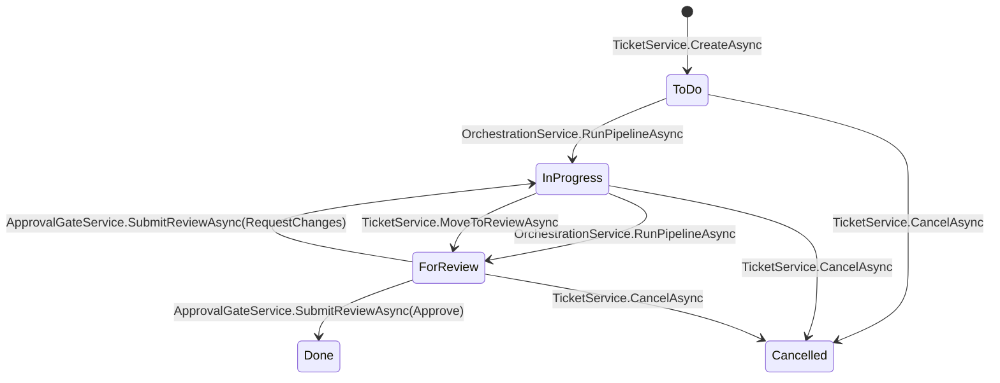

# Application Module (`TeamPilot.Application`)

[← Back to README](../README.md)

## Purpose

`TeamPilot.Application` is where use cases live: it orchestrates Domain entities to fulfill a
request, defines the **interfaces** (ports) that Infrastructure implements, and is the layer
that enforces both role-based authorization and per-project data scoping. It depends only on
`TeamPilot.Domain` plus a small set of framework-agnostic packages (FluentValidation, the
`Microsoft.Extensions.*` abstraction packages for logging/options/DI — never a concrete
implementation like EF Core or ASP.NET Core).

Its role in the architecture is the Dependency Inversion boundary: Presentation and
Infrastructure both depend on it, but it depends on neither.

## Feature folders

| Folder | Responsibility |
|---|---|
| [`Auth/`](../src/TeamPilot.Application/Auth) | Login/refresh/logout use cases, audit logging, JWT/refresh-token/email-validation abstractions |
| [`Users/`](../src/TeamPilot.Application/Users) | Admin user management: roles, enable/disable, project assignment |
| [`Projects/`](../src/TeamPilot.Application/Projects) | Project CRUD, project-scoped listing for non-admins |
| [`Tickets/`](../src/TeamPilot.Application/Tickets) | Ticket board CRUD, branch linking |
| [`Agents/`](../src/TeamPilot.Application/Agents) | Provisioning/self-healing the 4 pipeline agents plus the standing `LiveAgent` per project; read/configure/activate-deactivate only, no manual creation |
| [`Instructions/`](../src/TeamPilot.Application/Instructions) | Versioned agent instructions |
| [`InstructionTemplates/`](../src/TeamPilot.Application/InstructionTemplates) | Admin-managed catalog of reusable instructions an admin can apply to a real agent |
| [`Orchestration/`](../src/TeamPilot.Application/Orchestration) | Running the standardized Research → Design → Coding → Testing pipeline for a ticket, including the bounded Coding/Testing retry loop |
| [`LiveAgentChat/`](../src/TeamPilot.Application/LiveAgentChat) | A project's chat with its `LiveAgent`: persists the conversation and runs a bounded Claude tool-use loop (read-only, sandboxed repo file access; ticket listing; ticket drafting) — see [LiveAgentChat / the Live Agent chat](#liveagentchat--the-live-agent-chat) below |
| [`Approval/`](../src/TeamPilot.Application/Approval) | The approval gate: review submission, merge, pipeline trigger |
| [`Conflicts/`](../src/TeamPilot.Application/Conflicts) | Merge-conflict detection and resolution |
| [`Pipelines/`](../src/TeamPilot.Application/Pipelines) | CI/CD status-tracking use cases |
| [`AuditLog/`](../src/TeamPilot.Application/AuditLog) | Read-side of the audit log |
| [`Git/`](../src/TeamPilot.Application/Git), [`Llm/`](../src/TeamPilot.Application/Llm) | `IGitService`/`ILlmConnector` port declarations (implemented in Infrastructure) |
| [`Common/Interfaces/IGitCredentialProtector.cs`](../src/TeamPilot.Application/Common/Interfaces/IGitCredentialProtector.cs) | Encrypts/decrypts a project's remote access token for storage (implemented in Infrastructure via Data Protection) |
| [`Reviews/`](../src/TeamPilot.Application/Reviews), [`Commits/`](../src/TeamPilot.Application/Commits) | Read-only repository interfaces for child records |
| [`Common/`](../src/TeamPilot.Application/Common) | `IUnitOfWork`, `ICurrentUserContext`, `IProjectAccessGuard`, shared exceptions, validator extensions |
| [`DependencyInjection/`](../src/TeamPilot.Application/DependencyInjection) | `AddApplication()` DI registration |

## Architectural decisions

**Per-aggregate repository interfaces, not a generic `IRepository<T>`.** `ITicketRepository`,
`IAgentRepository`, `IUserRepository`, etc. each expose exactly the query shapes their use
cases need (e.g. `ITicketRepository.GetByIdAsync` eager-loads the full ticket graph;
`ListAsync` is a lean, `AsNoTracking()`-friendly projection). A single generic repository would
either force every caller to accept a fat interface or push `Include()`/`AsNoTracking()`
decisions into a shared, one-size-fits-all method — this violates Interface Segregation for
marginal code reduction, so it was rejected.

**`IProjectAccessGuard` centralizes project-scoping instead of repeating it.** Every
ticket-board-adjacent service (`TicketService`, `AgentService`, `InstructionService`,
`OrchestrationService`, `ApprovalGateService`, `ConflictResolutionService`, `PipelineService`,
`ProjectService`) calls `projectAccessGuard.EnsureAccessAsync(projectId)` before acting.
Admins bypass it; everyone else must have that project in their `UserProjectAssignment` set.
This is enforced **in Application, not just at the controller** — a design decision made
explicitly so that a future second HTTP surface (or a background job) can't accidentally skip
the check by calling a service directly.

**FluentValidation over `DataAnnotations`.** Validators are independently testable classes
(`CreateTicketRequestValidator`, etc.), support conditional/cross-field rules the domain
actually needs, and are resolved via DI (`AddValidatorsFromAssemblyContaining<T>()`) rather
than being coupled to ASP.NET Core's model-binding pipeline — so the same validation runs
regardless of what calls the service.

**`ICurrentUserContext` is declared here, implemented in Presentation.** The interface only
needs `UserId`, `Name`, `Email`, `Roles`, and `IsInRole(role)` — it says nothing about
`HttpContext` or claims. This lets every service that needs "who is calling right now" depend
on an Application abstraction instead of reaching into ASP.NET Core.

**`IUnitOfWork` hides EF Core's transaction API.** `ExecuteInTransactionAsync` wraps
`IDbContextTransaction` inside the Infrastructure implementation so Application code can
express "these steps are atomic" without importing an EF Core type.

**DTOs double as API request/response contracts.** There is no separate "API model" layer —
`TicketDto`, `CreateTicketRequest`, etc. are used directly by controllers. This avoids a
duplicate mapping layer; the trade-off is that Application DTOs are, by construction, also part
of the public HTTP contract, so changing one is a breaking API change.

**Projects are tied to a remote repository, not a pre-existing local one.** `ProjectService.CreateAsync`
encrypts the submitted access token via `IGitCredentialProtector`, then calls
`IGitService.CloneAsync` *before* persisting anything — a bad URL/token throws
`GitOperationException` and nothing is saved, so there's no partial/orphaned project row to
retry or clean up. The clone runs synchronously within the request; there's no background
job/status-polling for it (see "Future considerations"). `Project.RemoteUrl` is immutable after
creation (re-pointing it would orphan the existing sandbox clone) — only `Name`/`Description`/
`BaseBranch` and the access token (via `RotateAccessToken`) can be changed later.

**Every ticket branch is cut from, and merges back into, `Project.BaseBranch`** — not a
hardcoded `"main"`. `TicketService.LinkBranchAsync` (manual) and `OrchestrationService`'s own
branch-linking step (automatic, at pipeline start) both fetch the remote, create the branch from
the base branch's current tip, and push it; the Coding stage pushes after every commit;
`ApprovalGateService.ApproveAsync` fetches, merges locally, commits the transaction, and *then*
pushes the base branch — a push failure at that last step surfaces as an error but does not roll
back the already-committed local approval (a deliberate simplification, not a full saga/outbox
pattern).

**A branch belongs to at most one ticket per project, permanently.** `TicketService.LinkBranchAsync`
is the one path where this could otherwise be violated - it's the manual "Link Branch" flow, and
it deliberately supports pointing a ticket at a branch that already exists (the UI's confirm
dialog covers this case explicitly). Before doing anything else, it calls
`ITicketRepository.GetByBranchNameAsync` and throws `BranchAlreadyLinkedException` (409) if a
*different* ticket already owns that name in the project. This is enforced permanently, including
against a `Cancelled` ticket's old branch: that branch still carries whatever commits it made
before being abandoned, so letting a new ticket attach to it would silently mix stale, unrelated
work into the new ticket's history - the supported way to "start over" is a new ticket (which
gets a fresh, never-used branch name), not reclaiming an old one. A composite unique index on
`(Ticket.ProjectId, Ticket.BranchName)`, filtered to non-null branch names, backs this at the
database level as well (see [docs/infrastructure.md](infrastructure.md)) - the service check
exists to fail with a clear message before that constraint would ever fire.
`OrchestrationService`'s own auto-linking step doesn't duplicate this check: it generates the
branch name from the ticket's own `Guid`, so a collision with another ticket is not a realistic
failure mode worth guarding against.

**Deleting a branch is manual, one ticket at a time, and only once that ticket is `Cancelled`.**
`TicketService.DeleteBranchAsync` is the escape hatch for the "permanent" claim above when a
branch's commits genuinely don't matter anymore: it deletes the branch from both the remote and
the local sandbox (`IGitService.DeleteBranchAsync`) and then calls `Ticket.UnlinkBranch()`,
which is what actually frees the name up for a different ticket to claim - see
[docs/domain.md](domain.md) for why that method is gated to `Cancelled`. This is deliberately
**not** an automatic side effect of `CancelAsync`: it's a real, irreversible delete against the
project's actual connected remote, and every other delete-shaped action in this app is either
explicitly not implemented or (like this one) requires its own explicit confirmation - see
[docs/user-guide.md](user-guide.md#good-to-know). Validation happens before the Git call: if the
ticket isn't `Cancelled`, `UnlinkBranch()` throws before `IGitService.DeleteBranchAsync` is ever
invoked, so a rejected request never touches the remote.

**The agent pipeline is fixed, automatic, and self-provisioning — there is no manual "assign
agents" or "create agent" step.** Every project always has exactly one active agent per pipeline
role (Research/Design/Coding/Testing), created by `AgentService.EnsureDefaultAgentsAsync` —
called once by `ProjectService.CreateAsync` for new projects, and again defensively by
`OrchestrationService.RunPipelineAsync` before every run so projects created before this existed
self-heal instead of failing. Agent creation isn't exposed via the API at all — `AgentService`
only reads, reconfigures, and activates/deactivates agents; the 4 pipeline agents are the only
agents *invoked automatically per ticket*, and a second Research/Design/Coding/Testing agent
would make "the project's agent for this role" ambiguous for the pipeline to pick, so nothing
creates one. `RunPipelineAsync` runs all four stages in that fixed order synchronously within one
call (no background-job infra, matching `ProjectService.CreateAsync`'s synchronous clone) and
always ends by moving the ticket to `ForReview`. When Testing reports failure (parsed from a
`RESULT: PASS`/`RESULT: FAIL` marker the Testing prompt asks for), Coding is re-run with
Testing's failure output fed back in as context, bounded at 3 total attempts — if still failing
after that, the pipeline stops retrying and moves to review anyway, since there's no
ticket-level "flagged" state; the retried commits and final Testing verdict are the visible
trail for a human reviewer. An admin can still edit any of the 4 agents' instructions
(Constitution/Guideline/Requirement) via `InstructionService` — that capability is unaffected by
any of this, only creating new pipeline agents is gone.

**A project also always has exactly one standing `LiveAgent` — a 5th agent, but not part of the
pipeline.** `AgentService.EnsureLiveAgentAsync` provisions it the same self-healing way as the 4
pipeline agents (called once by `ProjectService.CreateAsync`, and again defensively by
`LiveAgentChatService.SendMessageAsync` before every chat message). Unlike the pipeline agents,
nothing invokes it automatically — a human converses with it directly through
`LiveAgentChat/`. See [LiveAgentChat / the Live Agent chat](#liveagentchat--the-live-agent-chat)
below.

### LiveAgentChat / the Live Agent chat

`LiveAgentChatService.SendMessageAsync` persists the user's message onto the project's single
`Conversation` (created lazily on first use), then runs a bounded (max 6 round-trip)
`ILlmConnector.SendConversationAsync` tool-use loop before persisting and returning the
assistant's final text reply:

- **Tools given to the model**: `list_files`/`read_file` (read-only, sandboxed — see
  [docs/infrastructure.md](infrastructure.md) for the sandbox guard and secret redaction),
  `list_tickets` (wraps `ITicketRepository.ListAsync`), and `propose_ticket(title, description)`.
- **`propose_ticket` never writes to the database.** It only captures the drafted title/
  description onto the assistant's `ChatMessage` row (`ProposedTicketTitle`/
  `ProposedTicketDescription`). The real `Ticket` is only created if/when the user clicks
  "Create ticket" on that message in the UI, which calls the ordinary
  `POST /api/projects/{projectId}/tickets` endpoint (`TicketService.CreateAsync`) directly — no
  separate "approve draft" endpoint exists. There is no "Draft" `TicketStatus`; the approval gate
  lives entirely in the chat UI, not in ticket state.
- **The model is instructed (both in `AgentDefaultInstructions.For(LiveAgent)` and in the
  `propose_ticket` tool's own description) to only draft a ticket when the user explicitly asks
  for one** — enforced through prompting, not code, since nothing stops the model from calling a
  tool it's told not to call in a given turn.
- **No write-capable `IGitService` method is ever registered as a tool here** — only
  `ListFilesAsync`/`ReadFileAsync`. The Live Agent has no code path that can create, modify,
  move, or delete anything in the sandbox.
- Conversation history is replayed to the model as plain user/assistant text turns on every
  message (no persisted tool-call history) — the tool-use loop itself is rebuilt fresh each
  request from whatever the model asks for that turn.

**Each stage's prompt is built with that agent's *current* instructions, re-read immediately
before the stage runs.** `OrchestrationService.GetInstructionsBlockAsync` calls
`IInstructionRepository.GetCurrentAsync` for all three `InstructionType`s right before building
that stage's prompt (not once, up front, for all four agents) — so if an admin edits an agent's
instructions while a ticket is already mid-pipeline, any stage that hasn't started yet picks up
the new content, including a Coding retry after a Testing failure. A stage already in flight when
the edit happens still uses whatever was current when its prompt was built, since the whole
pipeline runs synchronously within one `RunPipelineAsync` call.

**`InstructionTemplate` is a flat, mutable catalog — deliberately not versioned like
`Instruction`.** `Instruction` is append-only because it's the audited history of what a real
agent has actually run on; a template is just a reusable starting point an admin picks from
before it becomes a real (versioned) `Instruction` on some agent, so overwriting a template in
place (`InstructionTemplateService.UpdateAsync` → `InstructionTemplate.Update`) loses nothing
that matters — the versioned trail lives on the agent, not the template. It's also, unlike
everything else in this module, not project-scoped at all: a template belongs to no `Project`,
so `IProjectAccessGuard` (which needs a `projectId` to check) doesn't apply and isn't called —
`GET /api/instruction-templates` (used by the instruction-editor's "Populate from template"
dropdown) is open to any authenticated user, the same as every other endpoint by default; only
creating/editing/deleting templates is `[Authorize(Roles = "Admin")]`, enforced per-action in
`InstructionTemplatesController` rather than for the whole controller, since GET stays open.

## Code style notes

- Services use C# primary constructors for DI (`public sealed class TicketService(ITicketRepository ticketRepository, ...)`).
- Every public method takes a trailing `CancellationToken cancellationToken = default` and
  threads it through to every repository/service call.
- Validation happens first in every method that has a validator:
  `await validator.EnsureValidAsync(request, cancellationToken);` (a custom extension in
  `Common/Extensions/ValidatorExtensions.cs` that throws the Application's own
  `ValidationException`, not FluentValidation's, keeping FluentValidation's exception type out
  of the rest of the codebase).
- Entity-to-DTO mapping is a private `static ToDto(...)` method at the bottom of each service —
  no AutoMapper, so the mapping is explicit and grep-able.
- Cross-feature references are normal within this project (e.g. `OrchestrationService`
  references `Tickets`, `Agents`, `Commits` DTOs) — feature folders organize by use case, they
  are not separate assemblies.

## Workflow integration

A typical write request flows: **Controller → Application service → domain entity method(s) →
repository (Infrastructure) → `IUnitOfWork.SaveChangesAsync()`**. Read requests skip the
domain-mutation step and go straight to a repository's lean, `AsNoTracking()` query, mapped to
a DTO.

The **ticket lifecycle** is the central workflow this module orchestrates:



`RunPipelineAsync` both starts a ticket (first agent assignment moves it out of To Do) and, in
the same call, runs it all the way through to For Review — see "The agent pipeline is fixed and
automatic" below. `TicketService.MoveToReviewAsync` remains as a manual escape hatch for an
In Progress ticket a human wants to push to review without invoking the pipeline again.

`TicketService.CancelAsync` is the escape hatch for a ticket whose goal is no longer valid (e.g.
a requirement changed) — it's reachable from any pre-merge status and is terminal (`Cancelled`
has no outgoing transition). Unlike `Approve`, cancelling never touches Git: since nothing about
a cancelled ticket has been merged into the base branch yet, there's nothing to revert — the
ticket's own feature branch (if any) is simply left orphaned on the remote.

**Cancelling while the pipeline is actively running for that ticket stops it before its next
stage, not mid-LLM-call.** `OrchestrationService.RunPipelineAsync` calls
`EnsureNotCancelledAsync` at the same four checkpoints where it re-reads instructions (before
Research, before Design, and before each Coding/Testing attempt), throwing
`InvalidTicketStateTransitionException` (409) if it finds the ticket `Cancelled` in the
meantime. This deliberately reads via `ITicketRepository.GetStatusAsync` — a fresh
`AsNoTracking()` query — rather than the `Ticket` instance already loaded at the top of the run,
because a second `GetByIdAsync` call against the *same* `DbContext` would just return that
already-tracked (and by now stale) instance from the change tracker's identity map instead of
seeing the other request's committed cancellation. What this can't do is abort an LLM call or
git push already in flight — cooperative, not preemptive — but it does mean a cancelled ticket
never gets a stray commit or a `MoveToReview()` added after the fact, since the run stops (and
never reaches its own `SaveChangesAsync`) as soon as it next checks.

Approving a ticket also triggers a `PipelineRun` via `IPipelineService.TriggerAsync` — the
approval gate and CI/CD status tracking are connected at this one point.

## Auth

Authentication *use cases* (not token mechanics — those are Infrastructure) live in
[`Auth/AuthService.cs`](../src/TeamPilot.Application/Auth/AuthService.cs):

- `LoginAsync`: validates the external `id_token` (via `IExternalIdentityValidator`), finds or
  creates the `User` by email, auto-grants Admin if the email matches `Auth:SeedAdminEmails`,
  blocks disabled accounts, and issues a new access + refresh token pair.
- `RefreshAsync`: rotates the refresh token. If the presented token was already rotated away
  (reuse), it revokes **every** active token for that user and audit-logs
  `TokenReuseDetected` — the standard mitigation for a stolen refresh token.
- `LogoutAsync`: revokes the presented refresh token.

**Role and project enforcement** happens at the call sites listed under "Architectural
decisions" above, plus one extra rule in `ApprovalGateService.SubmitReviewAsync`: submitting a
`ReviewDecision.Approve` requires the caller to be `Admin` or `Developer` — an `Analyst` can
submit `RequestChanges`/`ResolveConflict` but not approve, matching the product's role
definitions. This check inspects the *request body* (the decision value), so it can't be
expressed as a static `[Authorize(Roles=...)]` attribute — it lives in the service.

## Example

```csharp
public async Task<TicketDto> SubmitReviewAsync(Guid ticketId, SubmitReviewRequest request, CancellationToken ct = default)
{
    await validator.EnsureValidAsync(request, ct);

    var ticket = await ticketRepository.GetByIdAsync(ticketId, ct)
        ?? throw new NotFoundException(nameof(Ticket), ticketId);

    await projectAccessGuard.EnsureAccessAsync(ticket.ProjectId, ct);

    if (request.Decision == ReviewDecision.Approve
        && !currentUser.IsInRole(UserRole.Admin)
        && !currentUser.IsInRole(UserRole.Developer))
    {
        throw new ForbiddenException("Only Developers or Admins may approve tickets.");
    }
    // ... record the review, approve + merge inside a transaction, trigger a pipeline run
}
```

## Error handling

| Exception | Meaning | Thrown by |
|---|---|---|
| `Common.Exceptions.ValidationException` | FluentValidation failed | `EnsureValidAsync` |
| `Common.Exceptions.NotFoundException` | Referenced entity doesn't exist | Any `GetByIdAsync` call site |
| `Common.Exceptions.ForbiddenException` | Wrong role or no project access | `IProjectAccessGuard`, role checks |
| `Common.Exceptions.AuthenticationFailedException` | Bad/expired/reused token, disabled account | `AuthService` |
| `Common.Exceptions.GitOperationException` | Clone/push/fetch against the remote failed (bad URL/token, unreachable host) | `IGitService` implementation (Infrastructure), propagated through `ProjectService`/`TicketService`/`OrchestrationService`/`ApprovalGateService` |
| `Domain.Exceptions.DomainException` (any subtype) | Domain invariant violated | Entity behavior methods, allowed to propagate unchanged |

None of these are caught within Application — they propagate to the API's
`GlobalExceptionHandler`, which is the single place HTTP status codes are decided (see
[docs/api.md](api.md#error-handling)).

## Future considerations

- **Mediator pattern:** as the number of use-case services grows, a mediator (e.g. MediatR)
  could reduce controller-to-service boilerplate — not adopted yet because the current number
  of use cases doesn't justify the extra indirection.
- **Real pipeline execution:** `PipelineService` only tracks status today; wiring it to an
  actual `ICiCdPipelineRunner` abstraction (mentioned as an option during Phase 2 planning but
  deferred) is the natural next step once real CI needs exist.
- **Async project cloning:** `ProjectService.CreateAsync` clones synchronously, which is fine
  for typical dev-repo sizes but would block the request for a very large repository. Mirroring
  `PipelineRun`'s Queued/Running/Succeeded/Failed status-tracking pattern for the clone itself
  would be the natural next step if that becomes a real problem.
- **Non-GitHub/GitLab credential conventions:** the PAT-as-username convention `IGitService`
  uses today is what GitHub and GitLab accept; Azure DevOps/Bitbucket/SSH deploy keys aren't
  supported yet.
- **Caching:** `ProjectService.ListAsync`'s per-request `GetAssignedProjectIdsAsync` lookup for
  non-admins is a candidate for short-lived caching if project-assignment churn stays low
  relative to read volume.
- **Review attribution:** `SubmitReviewRequest.ReviewerName` is still a client-supplied free-text
  field rather than derived from `ICurrentUserContext` — the Approve role gate itself doesn't
  depend on it, but tightening this would improve audit-trail integrity (a user could type any
  name into the field today).
